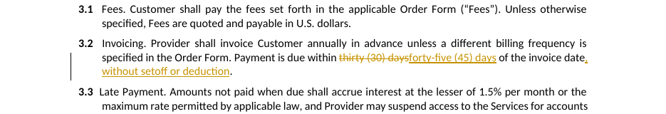
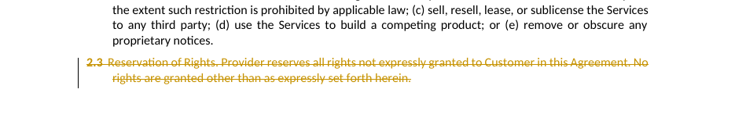
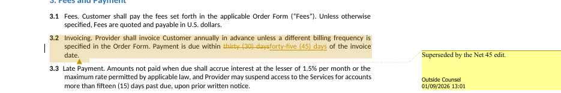
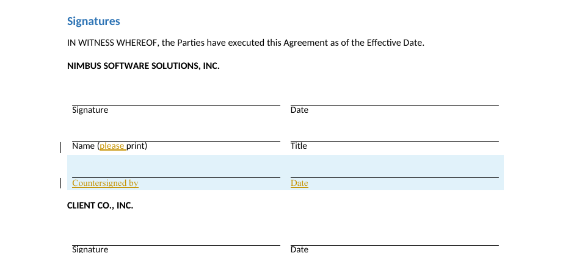
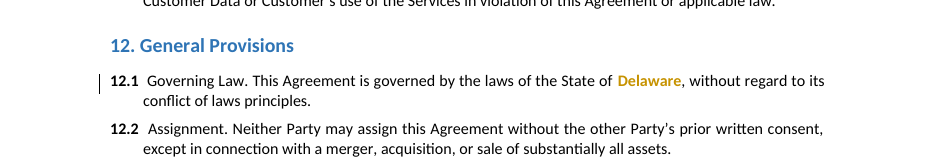
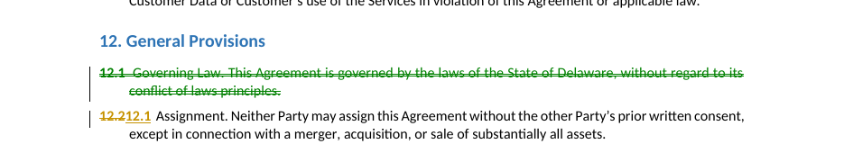
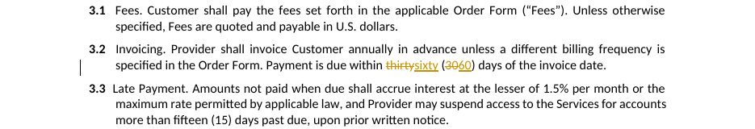
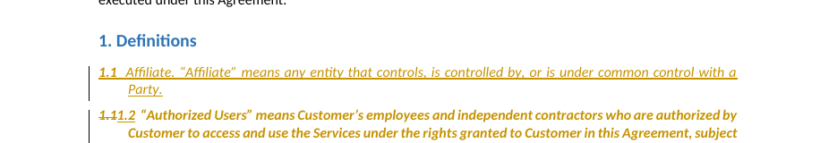
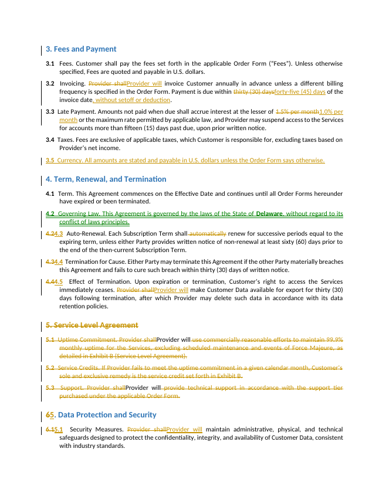

# docx-redline

[](https://github.com/gh-aswanth/docx_walking/actions/workflows/ci.yml)
[](https://www.python.org/downloads/)
[](LICENSE)


Production-grade **tracked changes (redlines)** for `.docx`, built on
[python-docx](https://python-docx.readthedocs.io) + `lxml`.

**[MPL-2.0](LICENSE)** — use it in your product, commercial or not. Files you
add stay yours; files of ours you modify stay open. See
[CONTRIBUTING.md](CONTRIBUTING.md).

Every edit is written as real OOXML revision markup — `w:ins`, `w:del`,
`w:moveFrom`/`w:moveTo`, `w:rPrChange`, `w:pPrChange`, `w:trPr/w:ins` — so the
output opens in **Word, LibreOffice and Google Docs** with a working
Accept/Reject review UI. Nothing here fakes a redline with strikethrough
formatting.

```python
from docx_redline import Redliner

rl = Redliner("contract.docx", author="Outside Counsel")
rl.replace_text("thirty (30) days", "forty-five (45) days")
rl.insert_paragraph_after(rl.find_paragraph(contains="3.4"), "3.5  Audit Rights. ...")
rl.delete_paragraph(rl.find_paragraph(contains="Late Payment"))
rl.save("contract_redlined.docx")
```

---

## What it produces

Every image below is rendered from the real file the matching example writes —
`.docx` → PDF → PNG, regenerated by `scripts/screenshots.py`, so a screenshot
cannot drift away from what the library currently does.

**Replace and insert** — the old span struck, the new text underlined, a change
bar in the margin. ([`01_quickstart`](examples/01_quickstart.py))



**Delete a whole clause** — text and paragraph mark both struck, so accepting
closes the gap cleanly. ([`01_quickstart`](examples/01_quickstart.py))



**Comments** — a `ReviewNote` anchored to its own span, in the margin, signed by
the agent that raised it. ([`12_edits_and_notes`](examples/12_edits_and_notes.py))



**Tables** — a tracked row insertion, and a word-level diff inside a single cell.
([`07_tables`](examples/07_tables.py))



**Formatting** — a `w:rPrChange`, so rejecting restores the old formatting rather
than leaving the new. ([`08_formatting`](examples/08_formatting.py))



**The renumbering cascade** — one `move_clause`, and the siblings it left behind
close ranks by themselves: 12.1 moves out, 12.2 becomes 12.1.
([`19_renumbering_cascade`](examples/19_renumbering_cascade.py))



**Document compare** — two files diffed into one redline, word by word.
([`23_document_compare`](examples/23_document_compare.py))



**A whole action-item plan** — 29 actions applied in one pass; here a new
definition is inserted and every later one renumbers behind it.
([`17_action_items`](examples/17_action_items.py))



<details>
<summary>A full page of the result, as a reviewer opens it</summary>



</details>

Regenerate after changing anything the examples produce:

```bash
uv run python examples/run_all.py            # rewrite examples/output/
uv run python scripts/screenshots.py         # re-render docs/images/
uv run python scripts/screenshots.py --check # or just assert they are current
```

Needs LibreOffice and poppler — `brew install --cask libreoffice && brew install poppler`.
The rendering is LibreOffice's, so it is close to Word's review view but not
identical: it shows `w:rPrChange` but drops it on its own re-export, which is
the limitation noted below.

---

## How it works

Ten short documents in [`docs/`](docs/), one per workflow, each built around a
diagram:

| | | |
|---|---|---|
| [1 · Tracked changes](docs/01-tracked-changes.md) | [2 · Document structure](docs/02-document-structure.md) | [3 · Clause renumbering](docs/03-clause-renumbering.md) |
| [4 · The action pipeline](docs/04-action-pipeline.md) | [5 · Chunked review](docs/05-chunked-review.md) | [6 · Merge & reconciliation](docs/06-merge-reconciliation.md) |
| [7 · Verification](docs/07-verification.md) | [8 · Document compare](docs/08-document-compare.md) | [9 · Failure modes](docs/09-failure-modes.md) |
| [10 · Paragraph addressing](docs/10-paragraph-addressing.md) | | |

Start with the [index](docs/README.md) for the system-level picture.

---

## Install

```bash
uv sync                       # everything, including the SDKs the suite exercises
uv sync --no-dev              # runtime only: lxml + python-docx

pip install docx-redline          # runtime only
pip install 'docx-redline[llm]'   # + the anthropic and openai SDKs
```

Requires Python ≥ 3.12. Two runtime dependencies, `lxml` and `python-docx`
(≥ 1.2, which is where comments arrived). The `llm` extra is needed only for
`--reviewer claude` / `--reviewer openai`; both SDKs are imported lazily inside
the reviewers, so the core install never reaches for them.

## Check that it works

```bash
uv run python examples/run_all.py     # 26 examples, every option, as a smoke test
uv run pytest -q                      # 350 unit tests
```

The demo applies **every** operation to a real contract, writes the files to
`output/`, and then proves the markup is semantically correct by resolving it
both ways:

```
accept(redlined) == the intended new document
reject(redlined) == the original document, byte-for-byte in text terms
```

It exits non-zero if any check fails, so it works as a CI gate.

```
  [PASS] output is a valid docx package
  [PASS] accept-all leaves no tracked changes
  [PASS] reject-all restores the original text
  [PASS] compare: accept == revised
  [PASS] LibreOffice preserved w:ins revisions
  ...
  22 passed, 0 failed
```

### Runnable examples

[`examples/`](examples/) holds 26 files, one per topic, demonstrating **every
option** in the library. Each is standalone, runs offline in under a second, and
prints what it did:

```bash
python examples/run_all.py          # run all 26, report pass/fail
python examples/13_rejections.py    # or just one
```

`run_all.py` exits non-zero if any example fails, so it works as a CI gate — an
example that stops running is a README that has started lying. See the
[index](examples/README.md) for what each one covers.

The end-to-end workflows have their own examples:

| | What it shows |
| --- | --- |
| [`01_quickstart`](examples/01_quickstart.py) | the smallest useful redline — a handful of `Redliner` calls |
| [`12_edits_and_notes`](examples/12_edits_and_notes.py) | paragraph-addressed review: index, render, verify, apply |
| [`16_model_output`](examples/16_model_output.py) | the same workflow driven from structured model JSON |
| [`17_action_items`](examples/17_action_items.py) | clause-aware redline from `examples/data/action_items.json` |
| [`20_pipeline_and_full_redline`](examples/20_pipeline_and_full_redline.py) | the staged pipeline: propose → apply → renumber → verify → report |
| [`10_review_accept_reject`](examples/10_review_accept_reject.py) | the accept/reject correctness gate |

---

## Three layers — pick the one you need

The library is three layers over the same revision engine. They compose, and
nothing forces you up a level you do not need.

| | 1 · `Redliner` / `ops.py` | 2 · `ParagraphIndex` | 3 · `ActionPlanner` / `RedlinePipeline` |
| --- | --- | --- | --- |
| Addresses content by | text, paragraph object, table index | **stable integer paragraph id** + quoted span | clause number (`"12.1"`) |
| Knows about clause numbering | no | reads it, does not rewrite it | yes — renumbers and fixes references |
| Verifies before writing | no | **yes** — every edit is located first | schema first, then clause resolution |
| Input | method calls, or a JSON op list | `RedlineEdit` / `ReviewNote`, or model JSON | action items from a reviewer or a file |
| Use when | you know exactly which paragraphs to edit | a model quotes spans back at you and may be wrong | a model is restructuring the document |

---

# Layer 1 · `Redliner`

## Constructor

```python
Redliner(
    source,
    author="Redline",
    initials=None,
    date=None,
    track_changes=True,
    scope=("body", "headers", "footers", "notes"),
)
```

| Option | Default | Meaning |
| --- | --- | --- |
| `source` | — | path, file-like object, or an existing `docx.Document` |
| `author` | `"Redline"` | attribution stamped on every revision |
| `initials` | derived | shown in Word's review pane |
| `date` | now | a `datetime` or ISO-8601 UTC string; pin it to make output byte-reproducible |
| `track_changes` | `True` | also set Word's *Track Changes* toggle, so later human edits keep being recorded |
| `scope` | all four | which stories document-wide operations touch: `body`, `headers`, `footers`, `notes` |

## Operations

| Category | Method | Word revision produced |
| --- | --- | --- |
| **Add** text | `insert_text`, `insert_text_before/after`, `append_text` | `w:ins` |
| **Add** paragraph | `insert_paragraph_before/after`, `append_paragraph` | `w:ins` + inserted ¶ mark |
| **Add** table row | `insert_table_row` | `w:trPr/w:ins` |
| **Remove** text | `delete_text`, `delete_matching` | `w:del` + `w:delText` |
| **Remove** paragraph | `delete_paragraph`, `delete_paragraphs` | `w:del` + deleted ¶ mark |
| **Remove** table row | `delete_table_row`, `delete_row` | `w:trPr/w:del` |
| **Replace** | `replace_text` (literal or regex, with backreferences) | paired `w:del` + `w:ins` |
| **Update** clause | `set_paragraph_text` — word-level diff, marks only what moved | minimal `w:del`/`w:ins` |
| **Update** cell | `set_cell_text` | minimal `w:del`/`w:ins` |
| **Move** | `move_paragraph`, `relocate_paragraph` | `w:moveFrom` / `w:moveTo` + range markers |
| **Format** runs | `format_runs`, `format_matching`, `format_paragraph_text` | `w:rPrChange` |
| **Format** paragraph | `format_paragraph`, `apply_style` | `w:pPrChange` |
| **Comment** | `add_comment` | `w:comment` (python-docx ≥ 1.2) |
| **Compare** two files | `redline_files`, `compare_documents` | full document diff |
| **Review** | `accept_all`, `reject_all`, `summary`, `text` | resolves / reports |

### Every signature

```python
# locating
rl.paragraphs(include_tables=True)                     -> list[Paragraph]
rl.tables()                                            -> list[Table]
rl.find_paragraphs(contains=None, regex=None, style=None,
                   startswith=None, ignore_case=False,
                   include_tables=True)                -> list[Paragraph]
rl.find_paragraph(...)                                 -> Paragraph      # exactly one, or raises
rl.find_text(needle, regex=False, ignore_case=False,
             limit=None)                               -> list[Match]
rl.text_of(paragraph)                                  -> str
rl.text()                                              -> str
rl.paragraph_style_names()                             -> list[str]

# text
rl.insert_text(paragraph, offset, text)
rl.insert_text_before(needle, text, **kw)              -> int
rl.insert_text_after(needle, text, **kw)               -> int
rl.append_text(paragraph, text)
rl.delete_text(paragraph, start, end)
rl.delete_matching(needle, regex=False, ignore_case=False, count=None)   -> int
rl.replace_text(old, new, regex=False, ignore_case=False,
                count=1, insertion_first=False)        -> int
rl.set_paragraph_text(paragraph, new_text, ignore_case=False)            -> int

# paragraphs
rl.insert_paragraph_before(reference, text="", style=None, copy_format=True)
rl.insert_paragraph_after(reference, text="", style=None, copy_format=True)
rl.append_paragraph(text, style=None)                  -> Paragraph
rl.delete_paragraph(paragraph)
rl.delete_paragraphs(paragraphs)                       -> int
rl.move_paragraph(paragraph, after)                    -> Paragraph
rl.relocate_paragraph(source, after=None, before=None)

# tables
rl.insert_table_row(table, index=None, values=None)    -> _Row
rl.delete_table_row(table, index)
rl.delete_row(row)
rl.set_cell_text(cell, new_text)                       -> int

# formatting
rl.format_runs(runs, **props)                          -> int
rl.format_matching(needle, regex=False, count=None, **props)             -> int
rl.format_paragraph_text(paragraph, **props)           -> int
rl.format_paragraph(paragraph, **props)
rl.apply_style(paragraph, name)

# comments, settings, output
rl.add_comment(paragraph, text, runs=None, author=None, initials=None)
rl.enable_track_changes(enabled=True)
rl.summary()                                           -> RevisionSummary
rl.accept_all() / rl.reject_all()                      -> Redliner
rl.save(path)                                          -> Path
```

`count=None` means *every* match; `count=1` (the default on `replace_text`) is
the first. `insertion_first=True` puts the new text before the strikeout;
Word's own Compare puts it after, which is the default here.

`author=` on `add_comment` overrides the Redliner's attribution for that one
comment, so a multi-agent review can sign each note with the agent that raised
it. Initials are derived from the name unless given.

### Finding what to edit

```python
rl.find_paragraphs(contains="Late Payment")  # substring
rl.find_paragraphs(regex=r"^\d+\.\d+\s")  # regex
rl.find_paragraphs(style="Heading 2")  # by style
rl.find_paragraph(startswith="3.4")  # exactly one, or raises
rl.find_text("Provider", ignore_case=True)  # character spans
```

All filters are ANDed. Searches cover the body, table cells, headers, footers
and foot/endnotes (configurable via `scope=`). Text already struck out by an
earlier revision is excluded, so repeated passes see the current state of the
document.

### Reading text back

```python
rl.text_of(paragraph)  # tracked insertions included, deletions excluded
```

Use this instead of python-docx's `Paragraph.text`: that property only looks at
`w:r` children, so it misses anything inside a `w:ins` (every insertion this
library makes) while still returning text that has been struck out. All of
`find_paragraphs`, `find_text` and the diff engine already use the correct
view.

### Replacing across run boundaries

Word splits `"within thirty (30) days"` into whatever runs the formatting
required. `replace_text` addresses the paragraph by flat character offset,
splits runs at the match boundaries and re-wraps them — so a phrase that spans
three runs with three different fonts is still one clean revision.

### Word-level updates

```python
para = rl.find_paragraph(contains="Termination")
rl.set_paragraph_text(para, rl.text_of(para).replace("thirty (30)", "sixty (60)"))
```

Only the changed words get marked, not the whole paragraph. That is the
difference between a reviewable redline and an unreadable one.

### Formatting revisions

```python
from docx.shared import Pt
from docx.enum.text import WD_ALIGN_PARAGRAPH

rl.format_matching("Confidential Information", bold=True, color="C00000")
rl.format_paragraph(para, alignment=WD_ALIGN_PARAGRAPH.CENTER, space_after=Pt(18))
```

| Target | Accepted `**props` |
| --- | --- |
| runs (`format_runs`, `format_matching`, `format_paragraph_text`) | `bold`, `italic`, `underline`, `strike`, `name`, `size`, `color`, `highlight` / `highlight_color`, `subscript`, `superscript`, and any other `run.font` attribute |
| paragraphs (`format_paragraph`) | `alignment`, `space_before`, `space_after`, `left_indent`, `right_indent`, `first_line_indent`, `line_spacing`, `keep_together`, `keep_with_next`, `page_break_before`, and any other `paragraph_format` attribute |

`color` takes a hex string (`"C00000"`); `highlight` takes a `WD_COLOR_INDEX`
or its name (`"YELLOW"`). Accepting keeps the new formatting; rejecting
restores the old, because the pre-edit properties are stored in the
`w:rPrChange` / `w:pPrChange` baseline.

---

# Layer 2 · `ParagraphIndex` — paragraph ids and verified edits

Clause numbers are the right address for a lawyer and the wrong one for a
machine: they move, they get renumbered, and a document with no numbering has
nothing to address at all. This layer gives every `w:p` a **stable integer id**
in document order, and refuses any edit whose quoted span does not match.

```python
from docx_redline import ParagraphIndex, Redliner, RedlineEdit, ReviewNote, verify_plan

rl = Redliner("contract.docx", author="Outside Counsel")
index = ParagraphIndex(rl)
plan_fingerprint = index.fingerprint()  # bind the plan to this version

print(index.render(para_ids=range(17, 22)))
# <<clause 3.2>>
# [19] 3.2  Invoicing. Provider shall invoice ... within thirty (30) days ...

verify_plan(index, plan_fingerprint)  # raises StalePlanError if it moved on

report = index.apply(
    [
        RedlineEdit(19, "thirty (30) days", "forty-five (45) days", agent="payment-terms"),
        ReviewNote(
            19,
            "annually in advance",
            "Confirm AP can fund an annual prepay.",
            agent="Payment Terms",
        ),
    ]
)
print(report.summary())
rl.save("contract_redlined.docx")
```

## The index

```python
ParagraphIndex(rl, include_tables=True)
```

| Member | Returns | Notes |
| --- | --- | --- |
| `len(index)`, `index[pid]`, `iter(index)` | `ParagraphRef` | `para_id`, `text`, `style`, `numbered`, `in_table`, `table_index`, `clause_label`, `level`, `is_empty` |
| `index.clauses` | `list[Clause]` | every numbered clause, in body order |
| `index.paragraph(pid)` | `Paragraph` | the live python-docx object behind an id |
| `index.find(needle, ignore_case=False)` | `list[int]` | ids of matching paragraphs, folded on both sides |
| `index.render(para_ids=None, with_clause_labels=True, skip_empty=True)` | `str` | the cacheable prefix a model reads; every line starts with the `[id]` an edit addresses |
| `index.manifest()` | `str` | routing input: one line per clause with its id range |
| `index.fingerprint()` | `str` | sha256 of the document's text, truncated to 16 hex |
| `index.locate(para_id, target, occurrence=1)` | spans or `Rejection` | resolve a quote without applying it |
| `index.apply(items)` | `ApplyReport` | verify everything, then write |
| `index.refresh()` | `ParagraphIndex` | re-index after structural work |

Ids are positions in `rl.paragraphs()` and stay valid as long as no paragraph
is inserted or deleted. Text edits, comments and formatting never move them.

## Edits and notes

```python
RedlineEdit(
    para_id,
    target,
    replacement="",
    rationale="",
    agent="",
    severity="medium",
    occurrence=1,
    insertion_first=False,
)

ReviewNote(para_id, target, body, agent="", severity="medium", occurrence=1)
```

| Field | Meaning |
| --- | --- |
| `para_id` | which paragraph, from `render()` |
| `target` | an **exact quoted span** from that paragraph — never an offset, never a line number |
| `replacement` | the new text; `""` is a pure deletion |
| `occurrence` | 1-based; `0` means every occurrence in the paragraph |
| `insertion_first` | put the insertion before the strikeout instead of after |
| `agent` | which reviewer raised it; signs the comment for a `ReviewNote` |
| `rationale` / `severity` | carried through to the report |

Quoted text is the address on purpose. Offsets do not survive a reparse; a
quote does, and a quote that no longer matches is a signal the document moved
on rather than a bug to route around.

## Rejections

Nothing is written until every item has been located, so a plan that is half
wrong cannot leave the document half edited by the time it is found out.

| `Rejection` | When | Applies to |
| --- | --- | --- |
| `PARAGRAPH_NOT_FOUND` | `para_id` out of range — the detail names the valid range | both |
| `EMPTY_TARGET` | target is empty or whitespace only | both |
| `TARGET_NOT_FOUND` | the quote does not match. **Never fuzzy-matched** | both |
| `TARGET_AMBIGUOUS` | the quote occurs more than once and is under 25 characters | both |
| `TARGET_ALREADY_STRUCK` | the text exists only inside an existing `w:del` | edits only — a note anchors to the paragraph instead and says so |
| `SPAN_CONFLICT` | an earlier edit in the same batch already claimed those characters | edits only |

```
11 applied, 3 rejected
  APPLIED  [payment-terms] p19: 'thirty (30) days'
  APPLIED  [security] p35: 'seventy-two (72) hours'
  REJECTED [rogue-agent] p19: 'thirty (30) days'  <- span_conflict: an earlier edit already claimed this span
  REJECTED [paraphraser] p19: 'net thirty (30) days from receipt'  <- target_not_found: re-quote it, do not fuzzy-match
  REJECTED [naming]      p6:  'Provider'  <- target_ambiguous: quote more context, or set occurrence
```

`report.applied` / `report.rejected` are lists of `EditResult`; `report.to_dict()`
serialises the whole run.

**Order of application.** Content edits are located against a snapshot of the
whole document and then applied **right to left**, so no applied edit
invalidates a pending offset. Review notes are the exception: they are anchors,
not rewrites, so they are validated up front but re-located against the
*finished* text and applied last — the same order `planning/actions.py` uses, and for the
same reason. A note whose words an edit just struck falls back to the whole
paragraph and records why.

Notes never claim spans, so a note and an edit can target the same words. That
combination is the normal case, not a conflict.

## `fold` — matching what Word actually stored

```python
from docx_redline import fold

fold("“twelve (12)–month” term")  # '"twelve (12)-month" term'
len(fold(s)) == len(s)  # always
```

A model quoting `"twelve (12) months"` with a straight apostrophe still matches
text Word stored with a smart quote. Every mapping is exactly one character to
one character — smart quotes, all six dashes, every exotic space, tabs — which
is what makes an offset computed on the folded string valid on the raw string
it came from. NFKC is applied one character at a time and kept only when it maps
1→1, so `Ａ` folds to `A` while the `fi` ligature is left alone rather than
expanding and shifting every offset after it.

## `fingerprint` / `verify_plan` — refusing a stale plan

```python
from docx_redline import fingerprint, verify_plan, StalePlanError

plan_fp = fingerprint(index)  # also accepts a Redliner, or a path
...  # hours later, the model returns a plan
verify_plan(index, plan_fp)  # raises StalePlanError if the text changed
```

```
StalePlanError: document moved on: plan was computed against 902892107d00df8a,
document is now 7c124e7d349baad0. Re-run the review.
```

This is the guard that stops a v3 redline landing on a v4 document. It hashes
text only, so re-attributing the author or re-stamping the date does not
invalidate a plan.

## Structured model output

```python
from docx_redline import load_edits, validate_edits

problems = validate_edits(payload)  # schema only, no document access
items = load_edits(payload)  # raises on a malformed batch
items = load_edits(payload, strict=False)  # keep the good ones, drop the rest
```

```json
[
  {"kind": "edit", "para_id": 19, "target": "thirty (30) days",
   "replacement": "forty-five (45) days", "agent": "payment-terms",
   "severity": "high", "rationale": "Net 45 matches our AP cycle."},

  {"kind": "note", "para_id": 15, "target": "reverse engineer",
   "body": "No carve-out for interoperability. Check local law.", "agent": "IP"}
]
```

`kind` is `"edit"` or `"note"` and defaults to `"edit"`. `strict=True` (the
default) raises rather than silently dropping items — a dropped finding is a
review that quietly did less than it claimed.

---

# Layer 3 · Action items and the pipeline

`RedlinePipeline` reads a `.docx`, gets a list of action items (from Claude or
from the offline reviewer), applies them as tracked changes, and — the part that
is easy to get wrong — works out the **consequential** edits nobody asked for.

```bash
python -m docx_redline pipeline contract.docx -o out.docx
python -m docx_redline pipeline contract.docx -o out.docx --actions plan.json
python -m docx_redline pipeline contract.docx -o out.docx \
    --reviewer claude --brief "Review for the Customer."
python examples/20_pipeline_and_full_redline.py       # every stage, run separately
```

```
EXTRACT -> PROPOSE -> VALIDATE -> COMPARE -> PLAN -> COMMENT -> RENUMBER -> VERIFY -> REPORT
```

| Stage | What it does |
| --- | --- |
| **extract** | parse the document into a clause tree (`ClauseTree`) plus an outline |
| **propose** | a `Reviewer` returns action items — Claude, OpenAI, or the offline rules |
| **validate** | schema-check the items *before* the document is touched |
| **compare** | diff a second `.docx` in, Word-Compare style (optional) |
| **plan** | resolve every clause reference, order content edits before structural ones |
| **comment** | attach review comments, after every edit |
| **apply** | write the tracked changes |
| **renumber** | derive clause numbers from position, rewrite labels and cross-references |
| **verify** | accept/reject the result and assert the numbering and references hold |
| **report** | `action_items.json`, `<name>.redlined.docx`, `<name>.redline_report.json` |

Every stage returns plain data, so any of them can be run on its own:

```python
from docx_redline import RedlinePipeline

pipeline = RedlinePipeline("contract.docx", author="AI Contract Reviewer")
tree = pipeline.extract()
proposal = pipeline.propose(None)  # or a path to an action-item file
pipeline.validate(proposal)
rl, plan = pipeline.apply(proposal)
pipeline.verify(rl)
pipeline.write(rl, "contract.redlined.docx", report_path="report.json")
```

## `RedlinePipeline` options

```python
RedlinePipeline(
    source,
    author="AI Contract Reviewer",
    date=None,
    reviewer="rules",
    brief=DEFAULT_BRIEF,
    renumber=True,
    strict=False,
    explain=True,
    revised=None,
    comments=None,
    similarity_floor=0.45,
    on_stage=None,
)
```

| Option | Default | Meaning |
| --- | --- | --- |
| `reviewer` | `"rules"` | `"rules"`, `"claude"`, `"openai"`, `"chunked"`, or a `Reviewer` instance |
| `brief` | customer-side | free-text review instructions handed to the model |
| `renumber` | `True` | derive clause numbers and rewrite cross-references |
| `strict` | `False` | abort on the first action that cannot be applied |
| `explain` | `True` | write each action's rationale into the `.docx` as a comment |
| `revised` | `None` | a second `.docx` to diff in first, Word-Compare style |
| `comments` | `None` | `[{"clause": "10.2", "text": "..."}, {"find": "...", "text": "..."}]` |
| `similarity_floor` | `0.45` | below this ratio a compared paragraph pair is delete + insert, not a word diff |
| `on_stage` | `None` | callback receiving a `StageLog` per stage, for progress reporting |

## `full_redline` — everything in one call

Three independent sources of edits, one document, one pass:

```python
from docx_redline import full_redline

result = full_redline(
    "contract.docx",
    "contract.redlined.docx",
    revised="counterparty_markup.docx",  # 1. diff this in, Word-Compare style
    reviewer="claude",  # 2. or actions=[...] / actions="plan.json"
    comments=[  # 3. annotate the finished redline
        {"clause": "10.2", "text": "Confirm the cap multiple with finance."},
        {"find": "quarterly in arrears", "text": "Billing cadence changed — flag revenue ops."},
    ],
    report_path="report.json",
)
assert result.ok
```

```python
full_redline(source, output, *, revised=None, actions=None, reviewer=None,
             brief=DEFAULT_BRIEF, comments=None,
             author="AI Contract Reviewer", date=None,
             renumber=True, strict=False, explain=True,
             similarity_floor=0.45,
             report_path=None, actions_path=None, on_stage=None)
```

Any subset works — compare alone, actions alone, comments alone, or all three.
Passing none raises rather than writing an unchanged file.

### Rationales end up in the document

Every action carries a `rationale`. By default the pipeline writes it into the
`.docx` as a Word comment anchored on the paragraph the action actually
touched, so the *why* sits beside the change in the review pane instead of only
in the JSON report:

```
[AI-001 · high] Align payment terms with our standard 45-day cycle.
[AI-006 · critical] Over-broad non-compete restriction; strike the whole limb.
```

It runs after renumbering, so a rationale never points at a paragraph a later
stage moved, struck or renumbered out from under it — and a deleted clause is
annotated on its strikeout. Turn it off with `explain=False` or `--no-explain`.
Actions with no rationale, actions that failed, and `comment` actions
themselves are not annotated.

`apply_actions` (the low-level primitive) leaves `explain` off by default; only
`RedlinePipeline` and `full_redline` turn it on.

### Passing action items

`actions=` takes any of three forms, and it wins over `reviewer=` when both are
given:

```python
full_redline(
    src, out, actions=[{"type": "move_clause", "clause": "12.1", "after_clause": "4.1"}]
)  # a list of dicts
full_redline(src, out, actions="plan.json")  # a path (str or Path)
full_redline(src, out, reviewer="claude")  # let a model decide
```

A plan file may be either `{"action_items": [...]}` or a bare JSON array. It is
**read only** — never rewritten, so a curated plan keeps your formatting and
ordering.

From the command line, `docx-redline full` maps one-to-one onto `full_redline`:

```bash
# a plan file
python -m docx_redline full contract.docx -o out.docx --actions plan.json

# inline, repeatable — id/rationale/severity are filled in for you
python -m docx_redline full contract.docx -o out.docx \
    --action '{"type":"move_clause","clause":"12.1","after_clause":"4.1"}' \
    --action '{"type":"reorder_clauses","section":"7","order":["7.2","7.1"]}'

# everything at once
python -m docx_redline full contract.docx -o out.docx \
    --actions plan.json \
    --revised counterparty.docx \
    --comment "10.2=Confirm the cap with finance." \
    --comment "find=quarterly in arrears=Flag to revenue ops." \
    --report report.json

# or let a model write the plan
python -m docx_redline full contract.docx -o out.docx --reviewer openai --effort high
```

Exit codes: `0` all checks passed, `1` a stage or check failed, `2` bad input
(nothing to do, malformed JSON, missing credentials). Schema-invalid action
items abort before the document is opened rather than half-applying.

**Order is the whole point**, and it is not negotiable:

- The **compare runs first**, so scripted actions address the document the diff
  produced. `full_redline(..., revised=X, actions=[{"find": "sixty (60) days", ...}])`
  matches text the compare introduced.
- **Comments run last**, so they anchor to finished text rather than to a
  paragraph a later action moved or struck. A comment can even target text that
  only exists because of the compare.
- **Renumbering runs once, at the very end**, over the combined result — and
  against a baseline captured *before* the compare. The planner is therefore
  constructed first and its `finalize()` deferred; that is what lets a compare
  that inserts a clause and an action that moves one produce a single coherent
  numbering, instead of two passes fighting.

`result.ok` is false if any stage or check failed, and the entry point exits
non-zero.

## The renumbering cascade

Contracts number their clauses in the body text, so a structural change is
never one edit. Ask for one move:

```json
{"id": "AI-007", "type": "move_clause", "clause": "12.1", "after_clause": "4.1",
 "rationale": "Surface governing law with the term provisions", "severity": "medium"}
```

and the pipeline derives the rest by itself:

```
--- consequential renumbering ---
      12.1  ->  4.2     Governing Law        <- the clause that moved
       4.2  ->  4.3     Auto-Renewal         <- destination siblings shift down
       4.3  ->  4.4     Termination for Cause
       4.4  ->  4.5     Effect of Termination
      12.2  ->  12.1    Assignment           <- source siblings close ranks
      12.3  ->  12.2    Force Majeure
      12.4  ->  12.3    Notices
      12.5  ->  12.4    Entire Agreement
      12.6  ->  12.5    Severability

--- cross-references rewritten ---
    Section 4.2 -> Section 4.3   in: Subscription Term: 12 months, ... auto-renewal per Section 4.3
```

How it works: numbers are **never** computed incrementally. After all
structural work is done, `ClauseTree.renumber()` re-derives every number from
its position in the document and diffs that against a snapshot taken before
anything moved. One pass, so a move that shifts two separate groups of siblings
— and an insert and a delete in the same run — cannot double-count each other.

Rules the cascade follows:

- Paragraphs already struck out, or marked `moveFrom`, are excluded from
  numbering — the document is numbered as it will read *once accepted*.
- Cross-references are found by scanning for `Section|Clause|Article|…` followed
  by a number, including lists (`Sections 10.2 and 10.3`), across the whole
  document — exhibits and tables included.
- A reference to a clause that was **deleted** is not silently remapped. It is
  reported under `dangling_references` with a warning, because only a human can
  decide what it should point to now.
- Renumbering a clause is itself a tracked change, *unless* the clause is one
  the redline just inserted or moved — editing inside an insertion would show
  reviewers a strikeout on text the original document never contained.

Turn the whole thing off with `--no-renumber` when you want the literal actions
and nothing else.

## Action-item vocabulary

This is the contract with the model. Structural actions are the ones that
trigger the cascade.

| Kind | Action type | Required | Optional | Consequences |
| --- | --- | --- | --- | --- |
| Text | `replace_text` | `find`, `replace` | `clause`, `all`, `regex` | — |
| Text | `insert_text` | `text` | `clause`, `anchor`, `position` | — |
| Text | `delete_text` | `find` | `clause`, `all`, `regex` | — |
| Text | `rewrite_clause` | `clause`, `text` | — | number preserved, body word-diffed |
| **Structural** | `insert_clause` | `text` | `after_clause`, `before_clause`, `into_section`, `title` | later siblings shift down |
| **Structural** | `delete_clause` | `clause` | — | later siblings close ranks; refs flagged |
| **Structural** | `move_clause` | `clause` | `after_clause`, `before_clause`, `into_section`, `position` | both groups renumber |
| **Structural** | `reorder_clauses` | `section`, `order` | — | section renumbers 1..n |
| **Structural** | `insert_section` | `title` | `after_section`, `text` | later sections shift |
| **Structural** | `delete_section` | `section` | — | takes its sub-clauses with it |
| **Structural** | `move_section` | `section` | `after_section`, `before_section`, `position` | subtree moves as a unit |
| Table | `insert_row` | `table`, `values` | `row` | — |
| Table | `delete_row` | `table`, `row` | — | — |
| Table | `update_cell` | `table`, `row`, `col`, `text` | — | — |
| Format | `format_text` | `find` | `clause`, `bold`, `italic`, `underline`, `color`, `highlight` | `w:rPrChange` |
| Format | `format_clause` | `clause` | `alignment`, `space_after`, `space_before`, `style` | `w:pPrChange` |
| Annotate | `comment` | `text` | `clause`, `find` | runs after every edit |

Every action also takes `id`, `rationale`, `severity`
(`low`/`medium`/`high`/`critical`) and `note`. Adding `clause` to a text action
scopes the search to that clause, so a phrase that appears in five places is
unambiguous. `position` is `"first"` or `"last"`.

Two action types are **derived, never supplied**: `renumber_clause` and
`update_cross_reference`. `validate_actions` rejects them if a model emits
them — letting the model renumber as well as the engine is how numbering
silently double-applies.

```python
from docx_redline import ActionPlanner, apply_actions, validate_actions

problems = validate_actions(items)  # schema only, no document access
report = apply_actions(rl, items, renumber=True, strict=False, explain=False)
report = ActionPlanner(rl, renumber=True, strict=False, explain=False).run(items)
```

`PlanReport` carries `.results` (per-action `id`/`type`/`status`/`detail`/`edits`),
`.renumbered`, `.references`, `.dangling_references`, `.warnings`, plus
`.applied` / `.failed` counts, `.format()` and `.to_dict()`.

### Move to the top, and reorder by number

`after_clause`/`before_clause` place a clause next to a named neighbour. For
"put it at the top", name the section instead:

```json
{"type": "move_clause", "clause": "10.3", "into_section": "10", "position": "first"}
```

```
  10.3 -> 10.1   Excluded Claims          <- moved to the top
  10.1 -> 10.2   Exclusion of Damages
  10.2 -> 10.3   Liability Cap
  SECTION 10.3 -> SECTION 10.1            <- the cap clause cited it; the citation follows
  Section 10.2 -> Section 10.3
```

`move_section` takes the same shape — `after_section`, `before_section`, or
`position: "first"` for the top of the document (which renumbers every section
and every cross-reference below it).

To restate a whole section's sequence, give the order explicitly:

```json
{"type": "reorder_clauses", "section": "7", "order": ["7.2", "7.1"]}
```

The `order` list is the *current* clause numbers in the desired new sequence;
the numbers themselves are then re-derived 1..n. Two things keep this
readable and safe:

- **Only what must move, moves.** The longest run already in relative order
  stays put, so `[A,B,C] -> [C,A,B]` is one move revision, not three. A
  reviewer sees the actual change instead of the whole section struck and
  re-added.
- **Unlisted clauses hold their slot.** If the section gained a clause the
  reviewer never saw, it stays where it is rather than drifting to the end;
  the listed clauses are permuted among the positions they already occupied.

A number in `order` that another action has since moved out of the section is
skipped with a warning; a number that exists nowhere in the document fails the
action, because that is a hallucination rather than a race.

### Moving a clause that was already edited

Word's move revision cannot carry the source's own strikeouts: deep-copying a
paragraph that holds `w:ins`/`w:del` leaves the deleted runs outside the
`w:moveTo` wrapper, and rejecting the redline resurrects them into the next
paragraph. When a move targets a clause an earlier action already edited, the
move is therefore recorded the way Word's own Compare records it — struck at
the source, inserted at the destination, with the destination carrying the
post-edit text — and the run report says so:

```
warning: a clause edited earlier in this run was moved: recorded as delete +
insert rather than a Word move revision, because the destination must not
carry the source's strikeouts
```

Clean clauses still get proper `moveFrom`/`moveTo` revisions, which Word labels
"Moved from"/"Moved to".

## What the reviewer is shown

The model receives the **whole document**, not just the numbered clauses:
recitals, signature blocks, every table, and the exhibits and schedules at the
end. On the sample contract that is 36 paragraphs — 39% — that were previously
never sent, including Exhibit A's fee schedule and Exhibit B's SLA credits. It
is also untruncated: `render_outline` caps each clause at 400 chars, which is a
summary view, so the reviewer gets `segments.render_document` instead.

Structure is detected from whatever signal the file carries, in descending
reliability — literal clause numbers, then `w:outlineLvl`, then Heading styles,
then `w:numPr` list levels, then a typographic guess, then fixed paragraph
windows. A document with no numbering at all previously rendered as an **empty**
`<agreement>`; now it renders in full.

```python
from docx_redline import render_document, detect_strategy, segment_document, iter_blocks

detect_strategy(body)  # "clauses" | "headings" | "windows"
iter_blocks(body, tree=None)  # every paragraph and table, in order
render_document(body, tree=None)  # everything, in reading order
segment_document(body, budget_tokens=25_000, strategy="auto", tree=None)  # request-sized pieces
```

**Targeting unnumbered content.** Numbered clauses use `clause: "3.2"`. Anything
else — an exhibit line, a recital — is targeted by quoting it in `find`, and the
quote must be unique in the document. An ambiguous quote is **refused**, not
applied to the first match:

```
'Order Form' appears in 2 paragraphs -- add a clause, quote more surrounding
text, or set all=true. Matches: 1.2  "Order Form" means the ordering document; ...
```

Tables render as `[table N]` with numbered rows, which is how `update_cell`,
`insert_row` and `delete_row` address them.

## Long documents: `--reviewer chunked`

A 300-page contract is ~280K tokens. That fits a 1M window, but one call has to
emit hundreds of action items in a single structured output and recall collapses
across that much dense legal text — findings cluster at the start and end with a
hole in the middle, and every retry re-spends the whole input.

`ChunkedReviewer` cuts the document on its **own structural boundaries** (not
pages — a `.docx` has none; Word computes pagination at render time), triages
which pieces warrant a full read, reviews the survivors concurrently, and merges:

```bash
python -m docx_redline full contract.docx -o out.docx \
    --reviewer chunked --provider claude \
    --segment-tokens 25000 --concurrency 6 \
    --merge-report merge.json
```

```python
from docx_redline import ChunkedReviewer, full_redline

full_redline(src, out, reviewer=ChunkedReviewer("claude", segment_tokens=25_000))
```

```python
ChunkedReviewer(engine="claude", *, segment_tokens=25_000, index_tokens=12_000,
                concurrency=6, triage=True, triage_effort="low",
                min_coverage=0.35, max_actions=None,
                cache_dir=None, use_cache=True, refresh=False,
                strategy="auto", max_attempts=3, max_split_depth=2,
                backoff=1.0, on_progress=None, **engine_options)
```

| Option | Default | Meaning |
| --- | --- | --- |
| `engine` | `"claude"` | which reviewer drives each segment |
| `segment_tokens` | `25_000` | target size of each reviewed piece |
| `index_tokens` | `12_000` | ceiling on the titles-only index |
| `concurrency` | `6` | segments reviewed in parallel |
| `triage` / `triage_effort` | `True` / `"low"` | one cheap call picks `deep`/`scan`/`skip` per segment |
| `min_coverage` | `0.35` | least share of the document that must get a full read |
| `max_actions` | `None` | keep at most this many items, most severe first |
| `cache_dir` / `use_cache` / `refresh` | — / `True` / `False` | per-segment reply cache, so a dead run resumes for free |
| `strategy` | `"auto"` | segmentation signal: `auto`, `clauses`, `headings`, `windows` |
| `max_attempts` / `max_split_depth` / `backoff` | `3` / `2` / `1.0` | truncation and transient-error recovery |
| `on_progress` | `None` | callback receiving a `SegmentProgress` per segment |

| | |
|---|---|
| **Segment** | packed on structural boundaries; a clause is never split |
| **Index** | titles only (~2.3K tokens for 300 sections), with local risk-keyword flags |
| **Triage** | one cheap call picks `deep` / `scan` / `skip` per segment |
| **Map** | one primed call, then a bounded thread pool |
| **Reduce** | re-id, ownership, dedupe, conflicts, pre-flight → one plan |

**Triage cannot silently drop content.** A segment the model never mentions
defaults to `scan`, never `skip`; any segment hitting two risk-keyword families
is forced to at least `scan`; and if `deep` covers less than `--min-coverage`
(35%) of the document, the selection widens until it does. Every `skip` is
recorded with its reason.

**The cached prefix is the whole invariant.** System prompt, brief and index sit
behind the cache breakpoint and are byte-identical across every segment call —
the opposite of a single-shot review, where the *contract* is the constant part.
On OpenAI the `prompt_cache_key` is derived from that prefix alone, so all
segments share one cache partition.

**Failures are recoverable, not silent.** Truncation retries with a larger
ceiling and then splits the segment. Transient errors retry. Per-segment replies
are cached to disk keyed by model, brief, prompt version and segment text, so a
run that dies on segment 12 of 20 resumes for free (`--cache-dir`, `--refresh`,
`--no-cache`). Missing credentials and a run where *every* segment failed both
raise — an empty result would read as a clean bill of health.

**The merge is adversarial towards its own input**, because independent segments
produce colliding ids and contradictory intentions, and applying the raw union
does not fail loudly — it reports `applied` on everything and hands back a
document that is quietly wrong. `planning/merge.py` re-ids, drops what a segment had no
business proposing, resolves each contested target to one winner, and resolves
every clause number and quote against the *untouched* document before the
planner opens it. Everything discarded is recorded with a reason in
`--merge-report`.

## Where action items come from

Three reviewers, one interface. Pick with `--reviewer`, or pass an instance:

```python
from docx_redline import ClaudeReviewer, OpenAIReviewer, RedlinePipeline, get_reviewer

RedlinePipeline("contract.docx", reviewer="rules")  # default, offline
RedlinePipeline("contract.docx", reviewer=ClaudeReviewer())  # ANTHROPIC_API_KEY
RedlinePipeline("contract.docx", reviewer=OpenAIReviewer())  # OPENAI_API_KEY
get_reviewer("chunked", provider="claude", concurrency=8)  # by name, with options
```

```python
ClaudeReviewer(
    model="claude-opus-5",
    effort="high",
    max_tokens=16_000,
    api_key=None,
    fallbacks=True,
    client=None,
    stream=True,
    timeout=300.0,
)

OpenAIReviewer(
    model="gpt-5.5",
    effort="high",
    max_tokens=16_000,
    api_key=None,
    base_url=None,
    client=None,
    stream=True,
    timeout=300.0,
)
```

`effort` is one of `low`, `medium`, `high`, `xhigh`, `max`. `stream=True` avoids
read timeouts on long reasoning turns; `client=` accepts a pre-built SDK client
for tests or a proxy.

```bash
python -m docx_redline pipeline contract.docx -o out.docx --reviewer claude --effort high
python -m docx_redline pipeline contract.docx -o out.docx --reviewer openai \
    --model gpt-5.4-mini --effort low
```

| | `ClaudeReviewer` | `OpenAIReviewer` | `RuleBasedReviewer` |
| --- | --- | --- | --- |
| SDK | `anthropic` | `openai` | none |
| Surface | Messages API | Responses API | — |
| How the shape is enforced | forced tool call, `strict: true` | structured outputs, `text.format` `json_schema` `strict: true` | constructed directly |
| Reasoning control | `thinking: adaptive` + `output_config.effort` | `reasoning.effort` | — |
| Prompt caching | `cache_control` on system + contract | `prompt_cache_key` per document | — |
| Default model | `claude-opus-5` | `gpt-5.5` | — |
| Credentials | `ANTHROPIC_API_KEY` / `ant auth login` | `OPENAI_API_KEY` | none |

Install the SDKs with the extra: `uv sync --extra llm` (or `pip install 'docx-redline[llm]'`).

**One schema, two providers.** Both are generated from a single field table
(`ACTION_FIELDS`), so they cannot drift on what an action item may contain — a
test asserts the schema's `type` enum matches the planner's `ACTION_SCHEMA`
exactly, and that every key any action accepts is expressible. The only
difference is dialect: both vendors' strict modes require every property to
appear in `required`, so optional fields are made nullable, but an `enum` can't
simply be widened. Anthropic gets `{"type": ["string","null"], "enum": [..., null]}`;
OpenAI gets `{"anyOf": [{"type":"string","enum":[...]}, {"type":"null"}]}`. The
nulls are stripped by `normalize_items` before validation, so the planner sees
identical dicts either way.

Each provider also fails loudly in its own idiom rather than returning junk:
a Claude refusal (`stop_reason == "refusal"`) or a missing tool call; an OpenAI
refusal content block, a truncated reply (`status == "incomplete"` — which
would otherwise surface as a baffling JSON parse error), or a non-JSON answer.

Missing credentials raise `RedlineCredentialsError` naming the variable to set,
rather than an SDK traceback. The two SDKs fail at different moments — OpenAI
refuses to build a client without a key, Anthropic builds one happily and
rejects the first request — so the translation wraps both.

`RuleBasedReviewer` is the default: it produces the same action-item shape from
local rules, so the pipeline is reproducible, testable and runnable with no API
key. It is what generates the committed `examples/data/action_items.json`.

Check credentials, model and latency with one tiny call:

```bash
python -m docx_redline doctor --provider claude --effort low
```

## Verification

The pipeline refuses to call a run successful without proving it:

```
  [PASS] redline reopens as a valid docx
  [PASS] reject restores the original document
  [PASS] accept changes the document
  [PASS] no tracked changes survive accept
  [PASS] accepted numbering is contiguous       <- every sibling group is 1..n
  [PASS] every cross-reference resolves         <- no "Section 12.1" pointing at nothing
  [PASS] reject restores the original numbering
```

`result.ok` is false if any stage or check fails, and the entry point exits
non-zero — so this drops into CI as-is.

---

## Comparing two documents

Word's *Compare* feature, in Python:

```python
from docx_redline import redline_files, compare_documents

stats = redline_files("v1.docx", "v2.docx", "redline.docx", author="Compare Bot")
print(stats.format())

rl, stats = compare_documents(
    "v1.docx", "v2.docx", author="Compare", date=None, track_changes=True, similarity_floor=0.45
)
```

The redline is built **on top of v1**, so its styles, numbering, headers and
section setup are preserved; paragraphs that only exist in v2 are grafted in
with their own formatting. Paragraph pairs below `similarity_floor` (0.45) are
treated as unrelated and emitted as a delete + insert rather than an
unreadable word-by-word diff.

---

## Reviewing what is already there

```python
from docx_redline import accept_file, reject_file, summarize

rl.summary().format(limit=10)  # human-readable
rl.summary().to_dict()  # counts by type and author
accept_file("redlined.docx", "final.docx")
reject_file("redlined.docx", "reverted.docx")
```

```
168 tracked change(s)
  delete                 64
  insert                 58
  move-from              12
  move-to                12
  paragraph-mark-delete  8
  paragraph-mark-insert  7
  format:rPrChange       3
  format:pPrChange       2
  row-insert             1
  row-delete             1
  authors: AI Contract Reviewer (168)
```

---

## Declarative edit plans

For redlines produced by a rules engine, a review service or an LLM, describe
the work as JSON and let the library apply it. This is the low-level layer —
no clause awareness, no renumbering.

```json
{
  "operations": [
    {"op": "replace_text", "old": "thirty (30) days", "new": "forty-five (45) days", "count": null},
    {"op": "insert_text", "match": "invoice date", "text": ", without setoff", "where": "after"},
    {"op": "delete_text", "match": "automatically", "count": 1},
    {"op": "insert_paragraph", "match": "3.4", "text": "3.5  Audit Rights. ...", "where": "after"},
    {"op": "delete_paragraph", "match": "Late Payment"},
    {"op": "update_paragraph", "match": "Termination", "text": "4.3  Termination. ..."},
    {"op": "move_paragraph", "match": "Governing Law", "after": "Notices"},
    {"op": "insert_row", "table": 0, "values": ["Enterprise", "500", "$180,000"]},
    {"op": "delete_row", "table": 0, "row": 1},
    {"op": "update_cell", "table": 0, "row": 1, "col": 2, "text": "$27,500"},
    {"op": "format_text", "match": "Confidential", "bold": true, "color": "C00000"},
    {"op": "format_paragraph", "match": "1. Definitions", "alignment": "CENTER"},
    {"op": "comment", "match": "Fees", "text": "Confirm with finance."}
  ]
}
```

| Shared key | Meaning |
| --- | --- |
| `match` | substring, or a regex if the substring finds nothing |
| `occurrence` | 0-based index when `match` hits several paragraphs |
| `count` | how many replacements/deletions; `null` for all |
| `regex`, `ignore_case` | matching flags on the text ops |
| `where` | `before`, `after` or `end` for `insert_text`; `before`/`after` for `insert_paragraph` |

```python
from docx_redline.editing.ops import apply_operations, validate

problems = validate(plan)  # dry-run the plan before touching the file
apply_operations(rl, plan, strict=True)  # strict: an op that matches nothing raises
```

---

## CLI

All four spellings run the same command:

```bash
uv run docx_redline ...        # console script, module spelling
uv run docx-redline ...        # console script, PEP 8 spelling
uv run python -m docx_redline ...
python docx_redline/__main__.py ...
```

```
docx-redline [--version] {full,pipeline,compare,apply,accept,reject,summary,validate,doctor}
```

### `full` — compare + action items + comments, renumbered and verified

```bash
python -m docx_redline full SOURCE -o OUTPUT [options]
```

| Option | Default | Meaning |
| --- | --- | --- |
| `-o, --output` | required | where to write the redline |
| `--author` | `AI Contract Reviewer` | revision author name |
| `--date` | now | ISO-8601 UTC stamp, e.g. `2026-08-19T00:00:00Z` |
| `--actions FILE` | — | JSON plan: a list, or `{"action_items": [...]}`. Read only |
| `--action JSON` | — | one inline action item; repeatable |
| `--revised FILE` | — | a second `.docx` to diff in first |
| `--reviewer` | — | `rules`, `claude`, `openai`, `chunked` |
| `--provider` | `claude` | which engine `--reviewer chunked` drives |
| `--model` | per provider | model override |
| `--effort` | `high` | `low`, `medium`, `high`, `xhigh`, `max` |
| `--brief TEXT` | customer-side | review instructions |
| `--timeout` | `300` | seconds to wait for one model call |
| `--no-stream` | off | do not stream the model response |
| `--segment-tokens` | `25000` | chunked: target segment size |
| `--concurrency` | `6` | chunked: segments reviewed in parallel |
| `--no-triage` | off | chunked: review every segment |
| `--min-coverage` | `0.35` | chunked: least share given a full read |
| `--max-actions` | — | keep at most N items, most severe first |
| `--cache-dir` / `--no-cache` / `--refresh` | — | chunked: per-segment reply cache |
| `--merge-report FILE` | — | write the segment/merge reconciliation report |
| `--comment CLAUSE=TEXT` | — | repeatable; `find=PHRASE=TEXT` anchors on a phrase |
| `--comments-file FILE` | — | JSON list of `{clause\|find, text}` |
| `--report FILE` | — | write the JSON run report |
| `--similarity` | `0.45` | below this a compared pair is treated as unrelated |
| `--no-renumber` | off | apply the edits, leave numbering and references alone |
| `--strict` | off | abort on the first action that cannot be applied |
| `--no-explain` | off | do not write rationales into the `.docx` as comments |

### `pipeline` — clause-aware run

```bash
python -m docx_redline pipeline SOURCE -o OUTPUT [options]
```

Same shape as `full`, minus the chunked and inline-action flags:
`--author --date --actions --reviewer --model --brief --report --no-renumber
--revised --comment --no-explain`. `--actions` here is read if it exists and
**written if it does not**, so a first run leaves a plan you can edit and replay.

### The rest

```bash
python -m docx_redline compare v1.docx v2.docx -o redline.docx [--author N] [--date D] [--similarity 0.45]
python -m docx_redline apply contract.docx plan.json -o redlined.docx [--author N] [--date D] [--lenient]
python -m docx_redline accept redlined.docx -o final.docx
python -m docx_redline reject redlined.docx -o reverted.docx
python -m docx_redline summary redlined.docx [--limit N] [--json]
python -m docx_redline validate plan.json
python -m docx_redline doctor [--provider claude|openai] [--model M] [--effort E] [--timeout S]
```

| Command | Notes |
| --- | --- |
| `compare` | Word-Compare two files into one redline |
| `apply` | run a declarative op plan; `--lenient` tolerates an op that matches nothing |
| `accept` / `reject` | resolve every tracked change one way or the other |
| `summary` | list revisions; `--json` for machine-readable, `--limit` caps the listing |
| `validate` | schema-check a plan without opening a document |
| `doctor` | one tiny call to check credentials, model and latency |

Exit codes throughout: `0` success, `1` a stage or check failed, `2` bad input.

### Example data

The worked example — a sample contract and a 29-item plan covering every action
type — lives in [`examples/data/`](examples/data/):

```
examples/data/Sample_Software_License_Agreement.docx
examples/data/action_items.json
```

A plan names its document by bare filename, resolved beside the plan file, so
the two move together as a pair.

---

## Design notes

**Revision ids.** Every `w:id` must be unique within a document. On open we
scan all parts for the highest existing id and continue from there, so a second
or third review pass never collides with the first — and different authors
stack correctly.

**Paragraph marks.** Inserting or deleting a paragraph is not just about its
runs: the ¶ mark itself carries `w:pPr/w:rPr/w:ins|w:del`. Get that wrong and
Word merges the wrong paragraphs on accept. When the target is the last
paragraph of its story there is no following mark to consume, so the mark on
the *preceding* paragraph is used instead — which is exactly what Word does
when you press Enter or Backspace at the end of a document.

**Nesting.** `w:ins` cannot contain another `w:ins`, but `w:ins` *can* contain
`w:del` — that is how "text I inserted, then deleted" is encoded. Inserting
into previously-inserted text splits the enclosing `w:ins` rather than nesting.

**Deleted text is not `w:t`.** Word requires `w:delText` inside `w:del` (and
`w:delInstrText` for field instructions). Files that skip this open, but the
text reappears in odd places on accept.

**Schema order matters.** `w:pPrChange` must be the last child of `w:pPr`,
`w:rPrChange` the last of `w:rPr`, and the `*PrChange` baselines are *base*
types — a `w:pPrChange` baseline may not contain `w:rPr` or `w:sectPr`. Those
are written back on reject rather than stored.

**Comments live in their own part.** Most `.docx` files ship an *empty*
`word/comments.xml`, which python-docx loads as an `XmlPart` whose `blob`
re-serialises its live element on demand. Appending to a tree parsed from that
blob writes nothing, and the result is a document full of `commentReference`
markers with no bodies behind them — comments that render blank in Word.
`add_comment` goes through python-docx's own comments API for exactly this
reason.

**Verification is the feature.** `accept_all` / `reject_all` are not just
conveniences; they are how the test suite proves correctness without a copy of
Word. Every test asserts both directions.

**Locating and applying are separate passes.** In `ParagraphIndex.apply`,
nothing is written until every item has been located. Locate lazily and the
second edit to touch a paragraph sees XML the first one already rewrote — its
text now sits in `w:delText` — and the miss gets misdiagnosed as a parse problem
rather than the collision it is.

### Known limitations

- `compare_documents` matches paragraphs by normalised text. Content moved a
  long way across a document shows as delete + insert rather than a move
  revision; use `move_paragraph` explicitly when you know something moved.
- Paragraphs grafted in from a revised file carry their own `numId`; if the two
  files use different numbering definitions, list numbering on inserted
  paragraphs may need fixing up.
- LibreOffice drops `w:rPrChange` on export (its own limitation). Word handles
  it. Insert/delete/move revisions survive LibreOffice fine — the demo's
  `--libreoffice` check verifies this.
- Content controls (`w:sdt`) are traversed but their bindings are not updated.
- python-docx's own `Paragraph.text` / `Paragraph.runs` do not see runs inside
  `w:ins`. Use `rl.text_of(paragraph)` (see above).
- `ParagraphIndex` ids are positional. They survive text edits and comments,
  but a structural pass that inserts or deletes paragraphs invalidates them —
  call `refresh()`, or re-plan against the new `fingerprint()`.
- `ParagraphIndex.locate` cannot address text already inside a `w:del`; it
  reports `TARGET_ALREADY_STRUCK` rather than guessing.

---

## Alternatives considered

| Approach | Why not |
| --- | --- |
| Word COM automation (`pywin32`) | True fidelity, but Windows-only and needs Word installed — unusable on a server. |
| LibreOffice headless macros | Cross-platform, but a heavy subprocess per document and it silently drops `w:rPrChange`. |
| `docx` → HTML → diff → back | Loses styles, numbering, headers and section setup on the way back. |
| Formatting-only "fake" redlines (strikethrough + colour) | No Accept/Reject, no author attribution, no audit trail. Not a redline. |
| `python-docx` + direct OOXML (**this**) | Pure Python, no external binaries, full control over the revision markup. |

## Layout

Four subpackages, strictly layered — each may import downward and never up. A
test asserts it, so the seam cannot quietly erode.

```
docx_redline/
  __init__.py       the public API: everything in this README imports from here
  errors.py         shared exception hierarchy
  cli.py            command line front end
  __main__.py

  oxml/             OOXML plumbing -- knows nothing about clauses or actions
    ns.py             namespace helpers
    elements.py       element construction + schema-order insertion
    revisions.py      author, timestamp, unique w:id allocation
    textmap.py        flat character map over a paragraph; run splitting
    edits.py          the primitives: ins / del / paragraph marks / rows / *PrChange
    diffing.py        word-level diff

  structure/        reading the document -- never writes a revision
    clauses.py        clause tree, renumbering cascade, cross-references
    segments.py       whole-document view: structure detection, rendering, segmentation

  editing/          applying edits -- everything here writes tracked changes
    redline.py        Redliner, the public API                         (layer 1)
    review.py         accept / reject / summarise
    compare.py        document-vs-document redline
    ops.py            declarative JSON edit plans, no clause awareness
    paragraphs.py     stable paragraph ids, folded matching,
                      verified edits, plan fingerprints                (layer 2)

  planning/         deciding edits -- decides *what* to change, editing/ does it
    actions.py        action-item vocabulary + the planner that derives consequences
    merge.py          reconciling proposals from segments that never saw each other
    agent.py          reviewers: Claude, OpenAI, and the offline rule-based one
    chunked.py        long documents: index, triage, parallel map, disk cache
    pipeline.py       the staged pipeline, and full_redline            (layer 3)
```

```
oxml  ->  structure  ->  editing  ->  planning  ->  cli
```

Submodule paths are stable and safe to import (`from docx_redline.oxml.ns import qn`),
but everything the public API needs is re-exported from the top-level package.

```
examples/                 26 runnable examples, one per topic + run_all.py
  data/                     the sample contract and the 29-item worked plan
  output/                   what the examples write (gitignored)
tests/                    pytest suite (350 tests)
docs/                     nine workflow documents, one diagram each
  images/                   README screenshots, generated from examples/output/
scripts/screenshots.py    .docx -> PDF -> PNG, for the gallery above
```

## Exceptions

| Exception | Raised when |
| --- | --- |
| `RedlineError` | base class: a requested edit could not be located or applied |
| `ClauseError` | a clause number could not be resolved against the document |
| `StalePlanError` | a plan was computed against a different version of the document |
| `RedlineCredentialsError` | a model-backed reviewer has no API key; names the variable to set |
