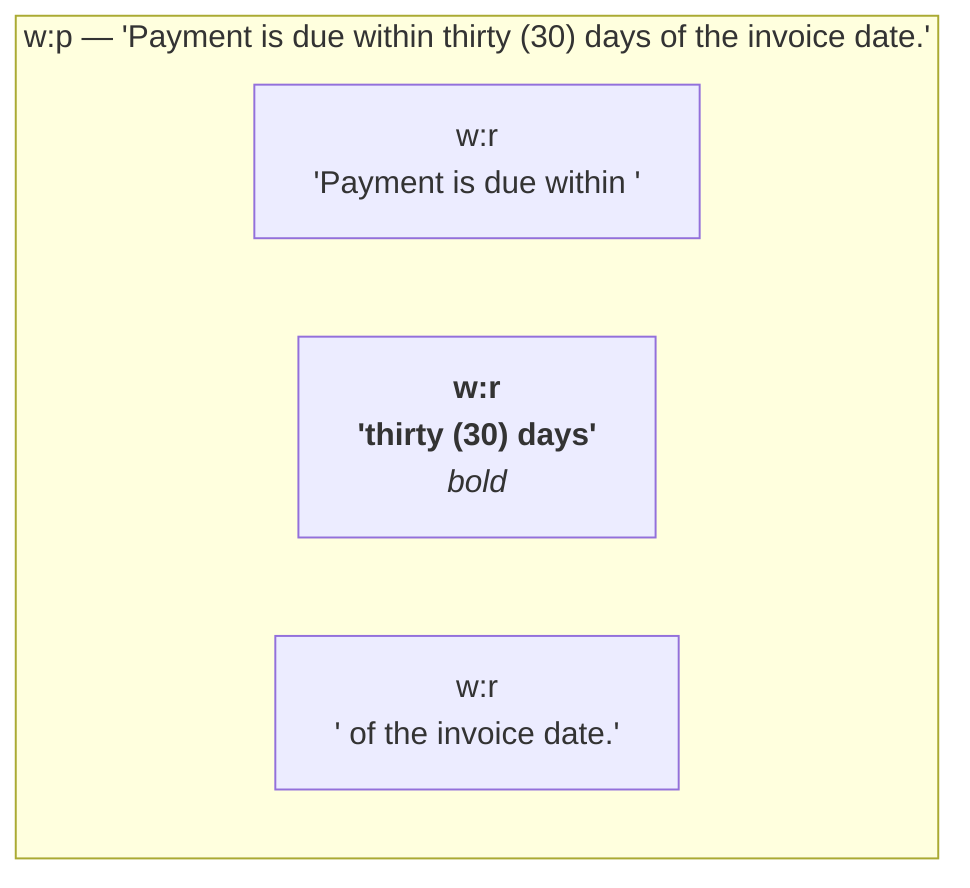
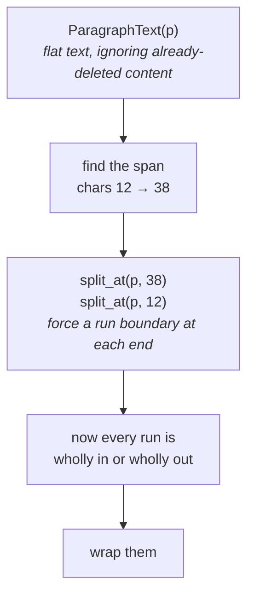
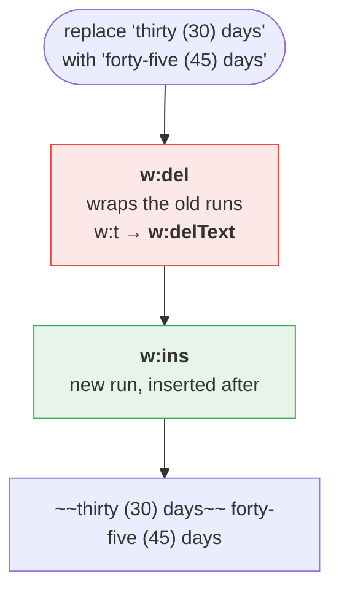
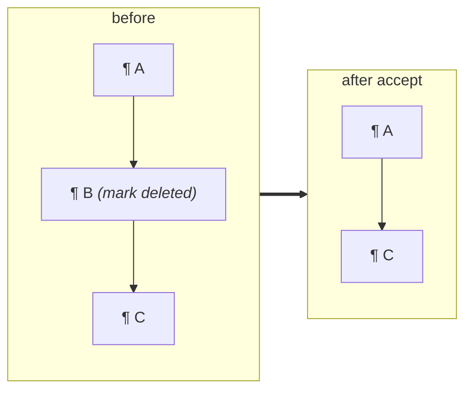
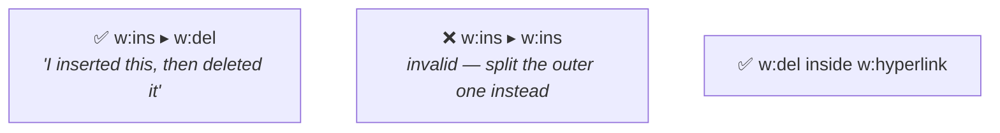
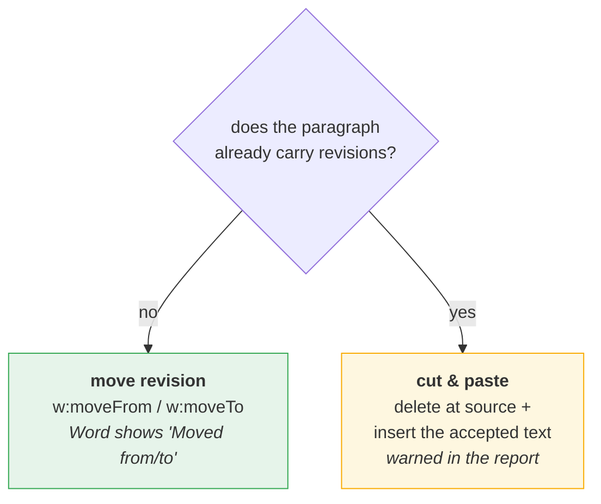
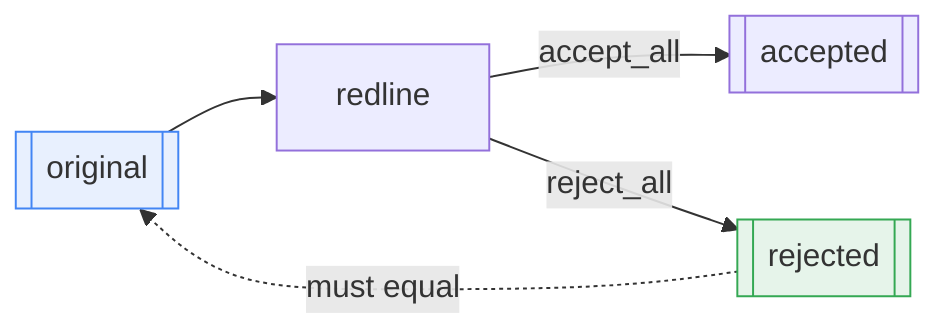

# 1 · Tracked changes

*How one edit becomes Word revision markup.*

Everything else in this repo eventually calls into here. The goal is that Word,
LibreOffice and Google Docs all show the change in their native review pane with
a working Accept/Reject button — not strikethrough formatting that merely looks
like a redline.

---

## The problem: Word does not store text as text

A paragraph is a sequence of *runs*, split wherever formatting changes. The
phrase you want to edit rarely lines up with them.

To replace `within thirty (30) days of` you must edit across three runs with
three different formats.

---

## The fix: a flat character map, then split at the boundaries

`textmap.py` builds the map and does the splitting; `edits.py` does the wrapping.

---

## What gets written

`w:t` **must** become `w:delText` inside a `w:del`. Files that skip this still
open, but the text reappears in odd places on accept.

---

## Every kind of change

| Change | Markup |
|---|---|
| Insert text | `w:ins` around the new runs |
| Delete text | `w:del` + `w:t`→`w:delText` |
| Replace | `w:del` then `w:ins` |
| Insert a paragraph | `w:ins` + inserted ¶ mark (`w:pPr/w:rPr/w:ins`) |
| Delete a paragraph | `w:del` + deleted ¶ mark |
| Move | `w:moveFrom` / `w:moveTo` + range markers |
| Insert / delete a table row | `w:trPr/w:ins` / `w:trPr/w:del` |
| Character formatting | `w:rPrChange` carrying the *previous* `w:rPr` |
| Paragraph formatting | `w:pPrChange` carrying the *previous* `w:pPr` |

### The paragraph mark is the part people get wrong

Deleting a paragraph is not just striking its runs — the ¶ mark itself carries
`w:pPr/w:rPr/w:del`. Get it wrong and Word merges the wrong paragraphs on accept.

---

## Nesting rules that actually matter

Editing text a previous pass inserted therefore **splits** the enclosing `w:ins`
rather than nesting inside it (`_escape_non_nestable`, `edits.py`).

---

## Moving a paragraph that was already edited

A `w:moveTo` copy cannot carry the source's own strikeouts — the deleted runs end
up *outside* the wrapper and reappear on reject.

This is what Word's own Compare does for edited-and-moved blocks.

---

## Proving it, without Word

`review.py` resolves the markup both ways: unwrap `w:ins` / drop `w:del` to
accept, the reverse to reject, merging paragraphs where a ¶ mark disappears.
`reject == original` is the single strongest check in the codebase.

---

## Where to look

| | |
|---|---|
| `textmap.py` | flat character map, run splitting |
| `edits.py` | `w:ins` / `w:del` / ¶-marks / rows / `*PrChange` |
| `redline.py` | `Redliner` — the public API |
| `review.py` | `accept_all` / `reject_all` / `summarize` |

**Next:** [Document structure →](02-document-structure.md)
