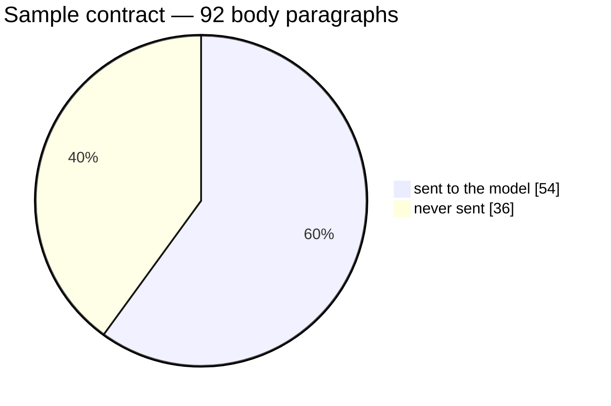
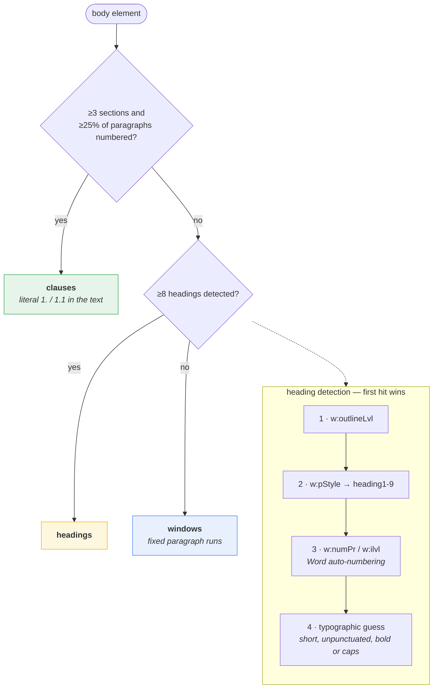
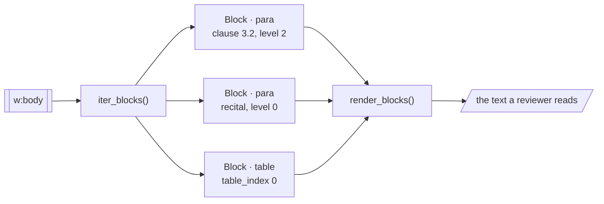
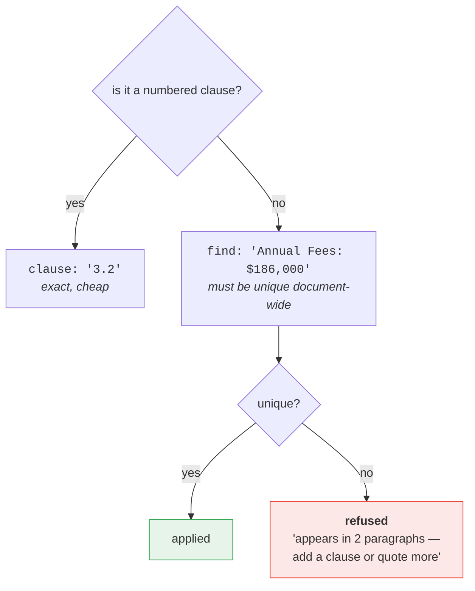
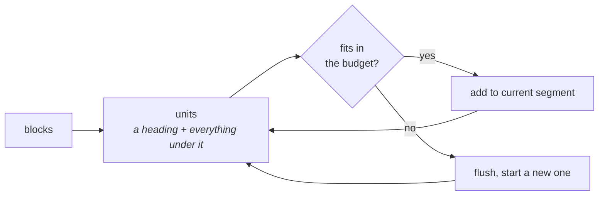

# 2 · Document structure

*How the document is read, and what the model is actually shown.*

---

## The problem this solves

`ClauseTree` answers "what is numbered here". That is the right model for
renumbering and the wrong one for review. Measured on the sample contract:



The 36 invisible paragraphs were the parties and recitals, both signature
tables, and **all three exhibits** — Exhibit A (the `$186,000` fee schedule),
Exhibit B (the SLA credit table), Exhibit C (the DPA). A reviewer that cannot
see the fee schedule is not a contract reviewer.

Two further gaps: clause bodies were capped at 400 characters, and on documents
without literal numbering the model received an **empty** `<agreement>`.

| Document shape | clauses found | what the model received |
|---|---|---|
| Literal numbers (`1.`, `1.1`) | 12 | clauses only, truncated, exhibits dropped |
| Word heading styles | **0** | **empty** |
| Word auto-numbering (`w:numPr`) | **0** | **empty** |
| Flat prose | **0** | **empty** |

---

## Structure detection

Whichever signal the file happens to carry, in descending reliability.



The first three signals are properties Word actually wrote. The fourth is a
guess and only fires when nothing else did.

> **Constraint.** A reviewer receives a `ClauseTree` whose root is the *body*
> element, so `word/styles.xml` is out of reach — style **ids** are readable,
> localised style **names** ("Überschrift 2") are not. `outlineLvl` and `numPr`
> are local to the paragraph and always work.

---

## The block walk

Every paragraph and every table, in reading order. Tables are one block, not one
per cell — `update_cell` addresses them by `(table, row, col)` anyway.



---

## What the model receives

Clauses keep their own numbers and are indented by depth. Unnumbered prose is
rendered verbatim. Tables get explicit markers, because there is no other way to
point at a cell.

```text
SOFTWARE LICENSE AND SUBSCRIPTION SERVICES AGREEMENT
This Agreement is entered into as of September 1, 2026 by and between:
Client Co., Inc., a company organized under the laws of the State of New York…
1. Definitions
  1.1  "Authorized Users" means Customer's employees and independent contractors…
3. Fees and Payment
  3.2  Invoicing. Provider shall invoice Customer annually in advance…
[table 0]
  row 0: Signature | Date
  row 1: Name (print) | Title
Exhibit A — Order Form Summary
Annual Fees: $186,000, payable annually in advance
```

---

## How an action item points at something



Ambiguity has to be an error. Without a `clause`, the scope is the whole body
and the first match wins — so a phrase quoted from an exhibit on page 240 would
silently edit page 1 and report `applied`.

---

## Segmentation

The same block walk packs into request-sized pieces on structural boundaries, so
a clause is never cut in half.



A unit larger than the budget becomes its own segment rather than being split
mid-clause. `DocSegment.split()` halves it later, at a heading, only if the model
truncates on it.

---

## Where to look

| | |
|---|---|
| `segments.py` | `detect_strategy`, `iter_blocks`, `render_document`, `segment_document` |
| `clauses.py` | `ClauseTree`, `render_outline` (the *summary* view) |
| `actions.py` | `_require_unique` — the ambiguity guard |

**Next:** [Clause renumbering →](03-clause-renumbering.md)
