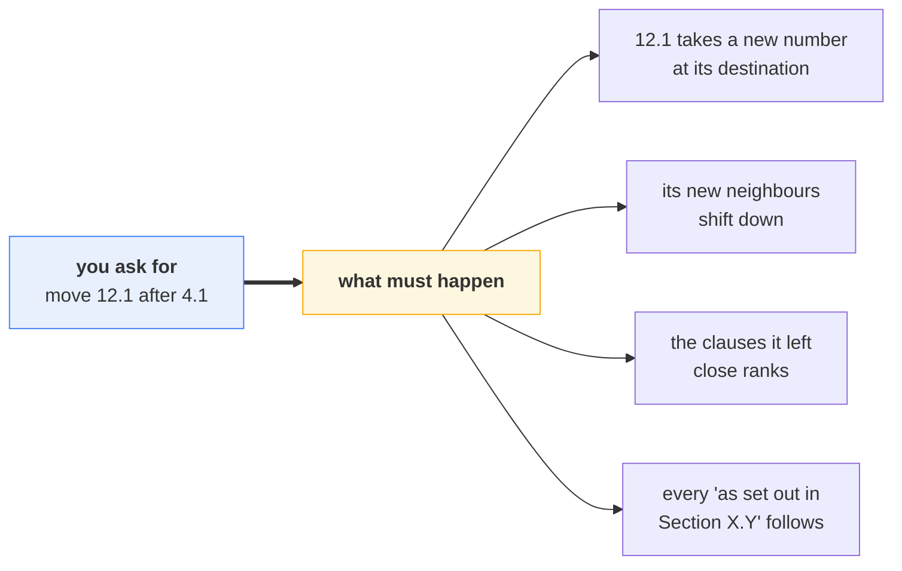
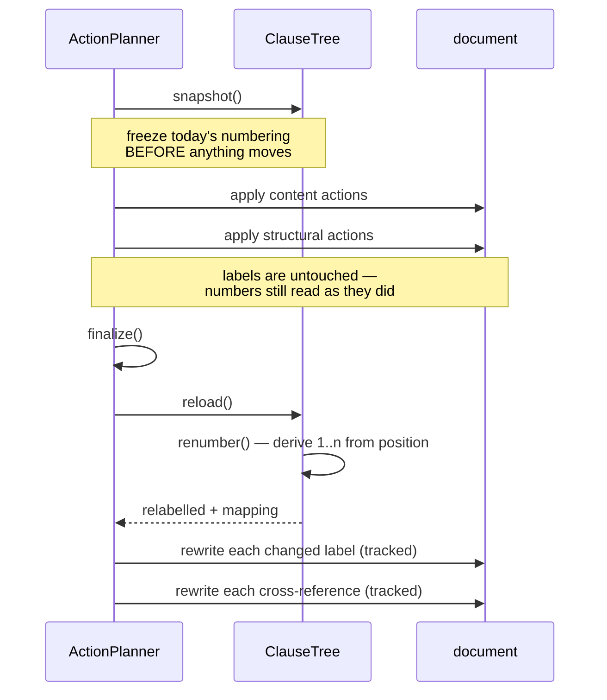
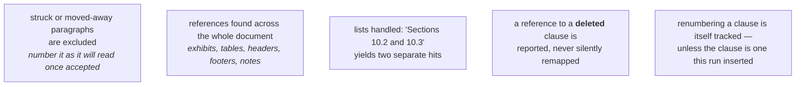
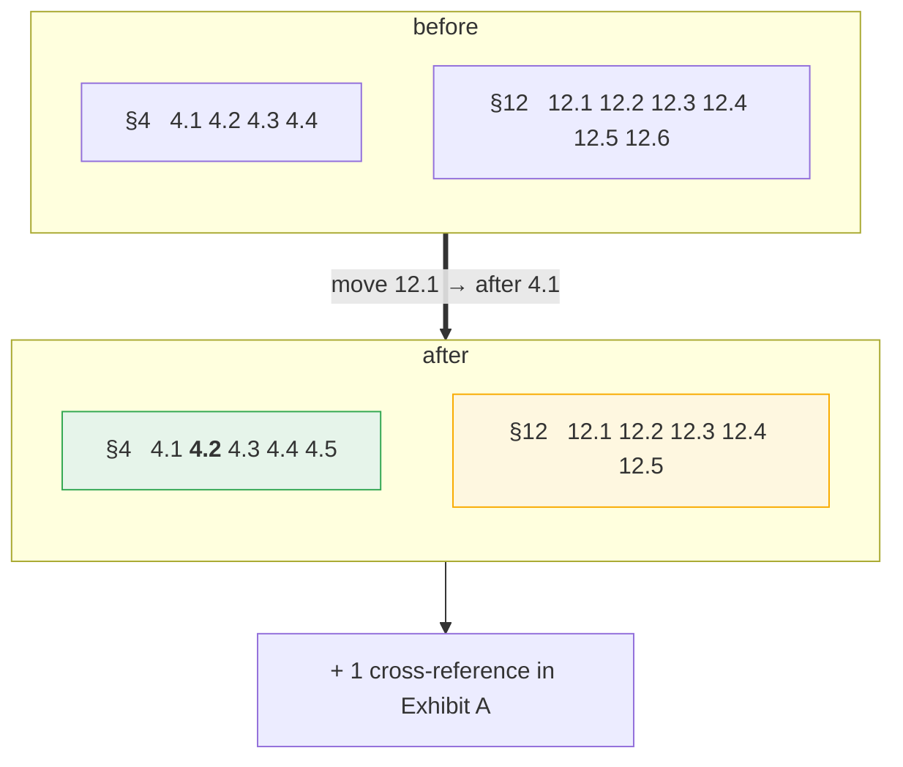
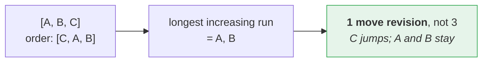
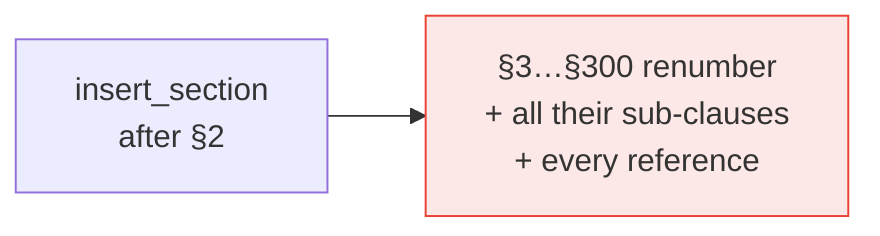

# 3 · Clause renumbering

*Why asking for one move rewrites 16 numbers and 5 cross-references.*

---

## The problem

Contracts number clauses in the **body text**, not with Word's auto-numbering.
So a structural change is never one edit:



The reviewer only says *what*. The engine derives the rest — and a model must
never emit its own renumbering, or it double-applies. `renumber_clause` and
`update_cross_reference` are **derived actions**: `validate_actions` rejects them
if a model supplies one.

---

## A real cascade

`{"type": "move_clause", "clause": "12.1", "after_clause": "4.1"}` produces:

```text
  12.1  ->  4.2     Governing Law           ← the clause that moved
   4.2  ->  4.3     Auto-Renewal            ← destination siblings shift down
   4.3  ->  4.4     Termination for Cause
   4.4  ->  4.5     Effect of Termination
  12.2  ->  12.1    Assignment              ← source siblings close ranks
  12.3  ->  12.2    Force Majeure
  12.4  ->  12.3    Notices
  12.5  ->  12.4    Entire Agreement
  12.6  ->  12.5    Severability

  Section 4.2 -> Section 4.3   in Exhibit A
```

---

## How it works: derive, never increment



**One pass, at the very end.** That is what lets a move that shifts two separate
sibling groups — plus an insert and a delete in the same run — produce a single
coherent numbering instead of several passes fighting.

---

## Rules the cascade follows



That last one matters: editing inside a `w:ins` would show reviewers a
strikeout on text the original document never contained.

---

## What "one structural action" really touches



---

## Reordering a section

`reorder_clauses` restates a section's sequence. Only the clauses that genuinely
have to move are moved — the longest run already in relative order stays put.



Clauses the request does not mention keep their exact slot, so an unlisted
clause never drifts to the end as a side effect.

---

## Blast radius — worth knowing

An `insert_section` near the front relabels **every** following section and
every clause beneath it, plus every cross-reference. On a 300-page contract that
is thousands of tracked changes from one action.



Turn it off with `--no-renumber` when you want the literal actions and nothing
else. The numbering checks are skipped too, since inconsistency is then expected.

---

## Where to look

| | |
|---|---|
| `structure/clauses.py` | `ClauseTree.renumber`, `LabelSnapshot`, `iter_references`, `collect_reference_edits` |
| `planning/actions.py` | `ActionPlanner._renumber`, `_rewrite_label`, `_rewrite_reference` |

**Next:** [The action pipeline →](04-action-pipeline.md)
