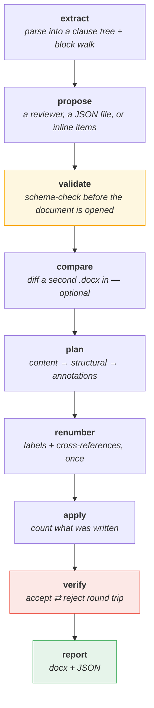
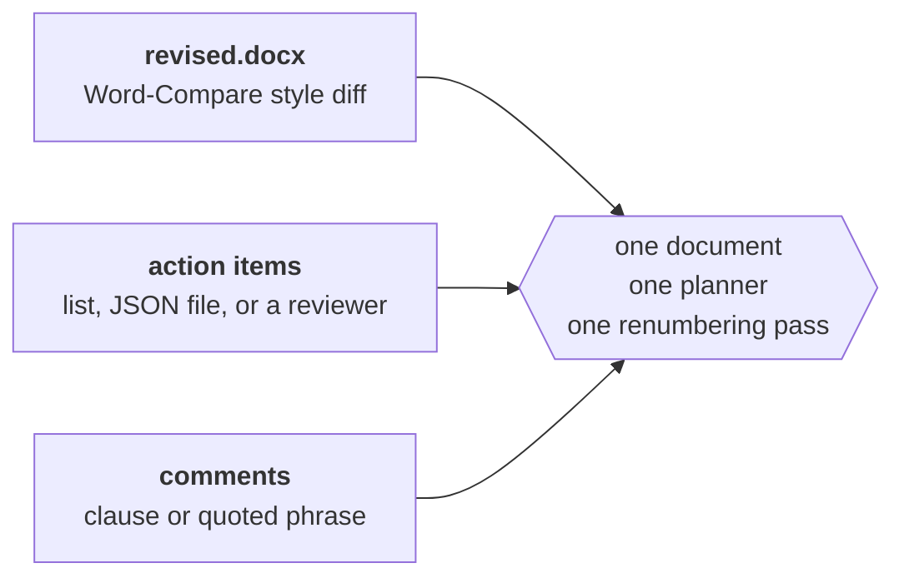
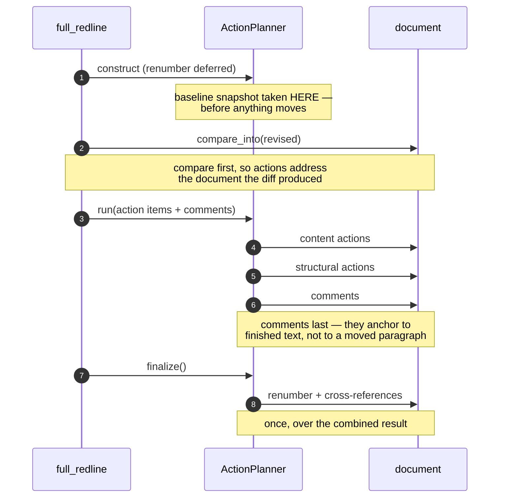
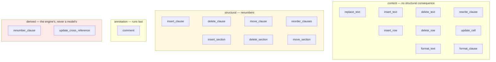
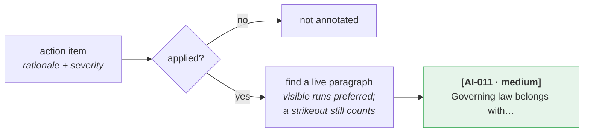

# 4 · The action pipeline

*What `full_redline` does, stage by stage.*

---

## The whole run



Any stage or check failing makes `result.ok` false, and the entry point exits
non-zero — so it drops into CI as-is.

---

## Three independent sources of edits



Any subset works. Passing none raises rather than writing an unchanged file.

---

## Order is the substance of it



Get this order wrong and a compare that inserts a clause fights an action that
moves one, producing two inconsistent numberings.

---

## The action vocabulary

**17 types, 33 fields.** Structural ones trigger the renumbering cascade.



Every action also takes `id`, `rationale` and `severity`
(`low` / `medium` / `high` / `critical`).

---

## An action item

```json
{
  "id": "AI-011",
  "type": "move_clause",
  "clause": "12.1",
  "after_clause": "4.1",
  "rationale": "Governing law belongs with the term provisions.",
  "severity": "medium"
}
```

Adding `clause` to a *text* action scopes the search, so a phrase appearing in
five places is unambiguous.

---

## Rationales reach the document

Each applied action's `rationale` is written into the `.docx` as a Word comment,
anchored on the paragraph it actually touched.



It runs **after** renumbering, so a rationale never points at a paragraph a later
stage moved or renumbered away. Turn it off with `explain=False` / `--no-explain`.

---

## Running it

```bash
# everything at once
python -m docx_redline full contract.docx -o out.docx \
    --actions plan.json \
    --revised counterparty.docx \
    --comment "10.2=Confirm the cap with finance." \
    --report report.json

# or let a model write the plan
python -m docx_redline full contract.docx -o out.docx --reviewer claude
```

```python
from docx_redline import full_redline

result = full_redline(
    "contract.docx",
    "out.docx",
    revised="counterparty.docx",  # optional
    actions="plan.json",  # or a list, or reviewer=…
    comments=[{"clause": "10.2", "text": "Confirm with finance."}],
    report_path="report.json",
)
assert result.ok
```

Exit codes: `0` all checks passed · `1` a stage or check failed · `2` bad input.

---

## What a run looks like

```text
  [ok ] extract    12 sections, 54 clauses, 92 paragraphs, 2 tables
  [ok ] propose    loaded 29 action items from action_items.json
  [ok ] validate   schema clean
  [ok ] plan       29/29 actions applied
  [ok ] renumber   39 clause number(s) rewritten, 5 cross-reference(s) updated
  [ok ] apply      168 tracked changes written, 29 comment(s) attached
  [ok ] verify     7/7 checks passed
  [ok ] report     wrote out.docx
```

---

## Where to look

| | |
|---|---|
| `pipeline.py` | `RedlinePipeline`, `full_redline`, the stage methods |
| `actions.py` | `ACTION_SCHEMA`, `validate_actions`, `ActionPlanner` |
| `agent.py` | reviewers and the action-item schema |

**Next:** [Chunked review →](05-chunked-review.md)
