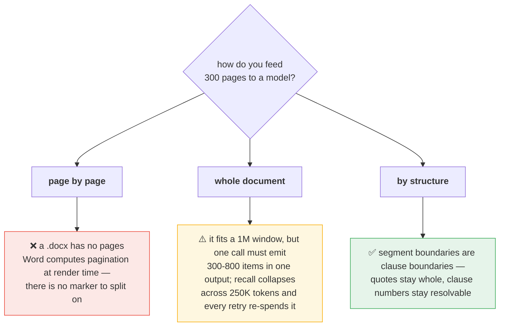
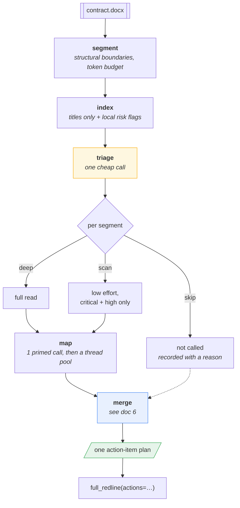
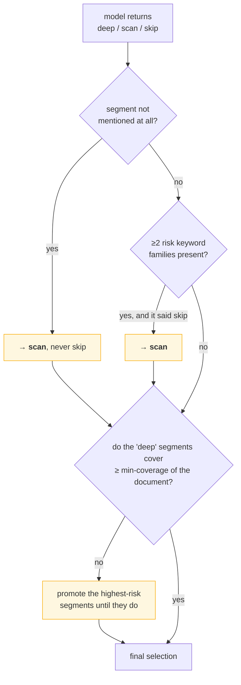
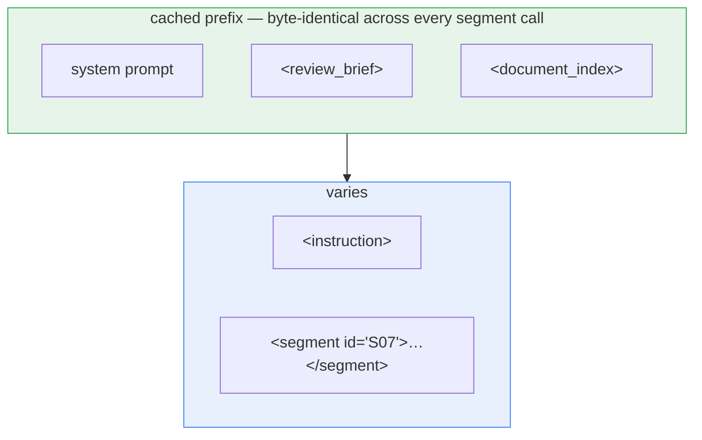
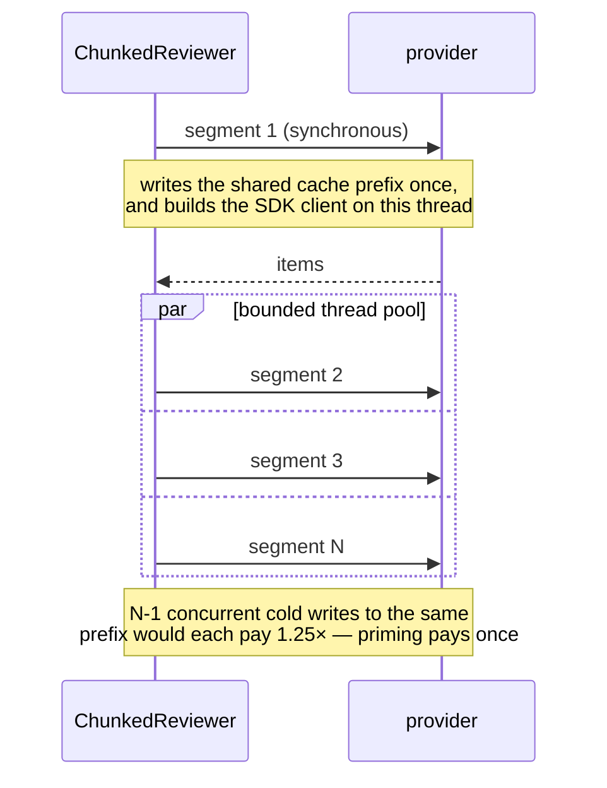
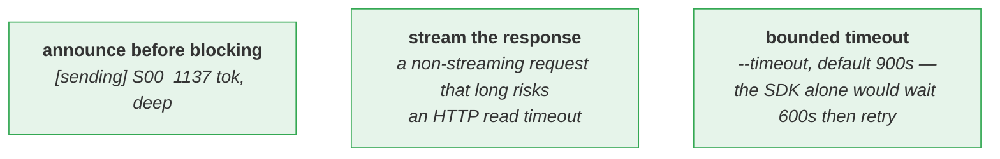
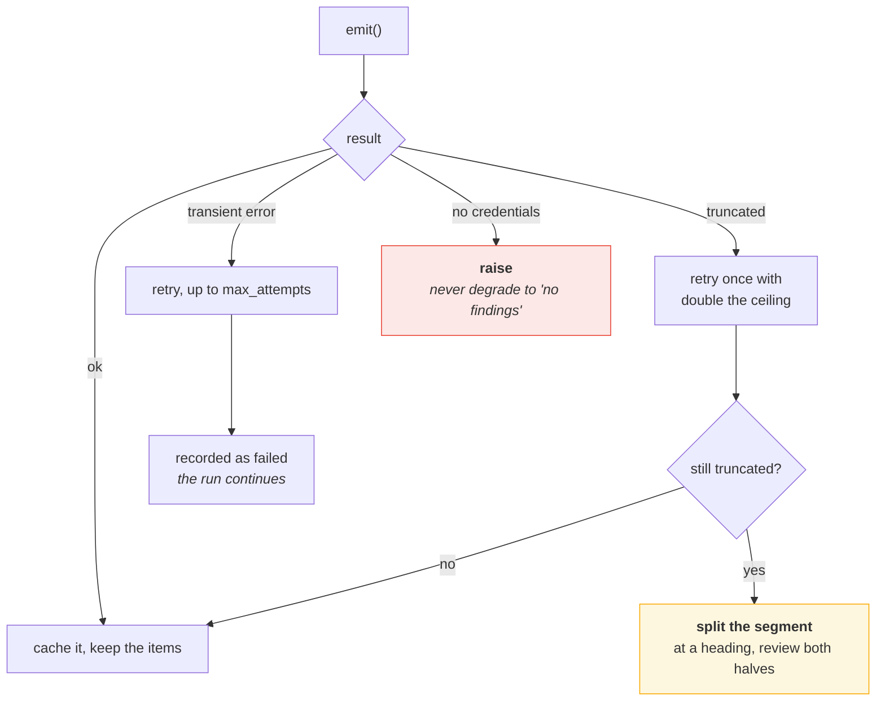
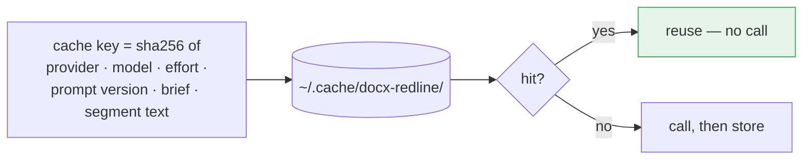

# 5 · Chunked review

*How a 300-page contract gets reviewed.*

---

## Why not just send the whole thing

Measured on a synthetic 300-page contract: **~280K tokens, 4,200 clauses**.



| | tokens |
|---|---|
| Full body | ~280,000 |
| Titles index, all 4,200 clauses | ~24,000 |
| Sections index, 300 sections | ~2,300 |
| `ClauseTree` parse of 4,200 clauses | **0.02 s** |

Local work is free. The model is the only cost centre.

---

## The shape



`ChunkedReviewer` satisfies the plain `Reviewer` protocol, so the pipeline needed
no change to accept it.

---

## Triage cannot silently drop content

Skipping is the one decision here that loses information without trace, so the
model's answer is advice, not authority.



Risk families are a **local, free** keyword scan — 13 of them (liability,
indemnity, termination, renewal, warranty, confidentiality, data, governing-law,
assignment, audit, insurance, IP, payment). They are the recall floor: if triage
misjudges, the keywords still pull the segment back in.

If the triage call itself fails, every segment is reviewed. `--no-triage` does
the same deliberately.

---

## The prompt layout inverts

For a single-shot review the **contract** is constant and the brief varies. For a
chunked run the **brief** is constant and the segment varies — so the brief moves
into the cached prefix.



- **Anthropic** — `cache_control: ephemeral` on the last invariant block.
- **OpenAI** — `prompt_cache_key` derived from that prefix **alone**, so all
  segments share one cache partition. Keying it on the varying part would give
  every segment its own and defeat caching entirely.

---

## Priming, then fanning out



The SDKs already retry 429/5xx with backoff, so the outer loop only handles
*semantic* failures.

---

## Why a run can look hung — and what stops it

A reasoning-heavy review of one segment legitimately runs for minutes. Three
things make that survivable rather than silent:



```text
  [segment] clauses strategy
  [triage ] deep:3, scan:0, skip:0
  [map    ]       0/3   3 segment(s) to review, 3 at a time
  [sending] S00         1137 tok, deep
  [ok     ] S00   1/3
  [sending] S01         1179 tok, deep
  [sending] S02          729 tok, deep
  [ok     ] S01   2/3
  [ok     ] S02   3/3
```

> **A small document is one segment.** With `--segment-tokens 25000`, a 12-page
> contract does not split at all — triage is skipped and it is a single call.
> `--effort high` on a reasoning model is the slow part; try `--effort medium`
> first, and `--segment-tokens 8000` if you want visible progress on a
> mid-sized file.

---

## When a call goes wrong



A run where **every** segment failed also raises — an empty result would read as
a clean bill of health.

---

## Resumability



A run that dies on segment 12 of 20 resumes at zero cost. Editing the brief or
bumping the prompt version invalidates by construction, not by hand.
`--cache-dir`, `--no-cache`, `--refresh`.

---

## Running it

```bash
python -m docx_redline full contract.docx -o out.docx \
    --reviewer chunked --provider openai \
    --segment-tokens 25000 --concurrency 6 \
    --min-coverage 0.35 \
    --cache-dir .cache/review \
    --merge-report merge.json
```

```python
from docx_redline import ChunkedReviewer, full_redline

full_redline(src, out, reviewer=ChunkedReviewer("claude", segment_tokens=25_000))
```

---

## Where to look

| | |
|---|---|
| `chunked.py` | `ChunkedReviewer`, `build_index`, `SegmentCache`, triage floors |
| `segments.py` | `segment_document`, `DocSegment.split` |
| `agent.py` | `emit()` — the shared transport both providers use |

**Next:** [Merge & reconciliation →](06-merge-reconciliation.md)
