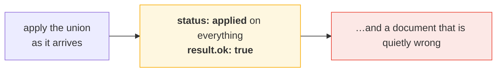
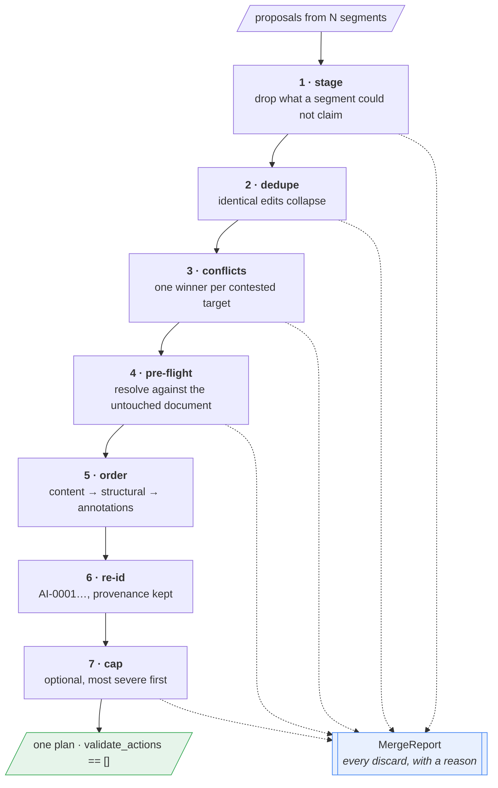
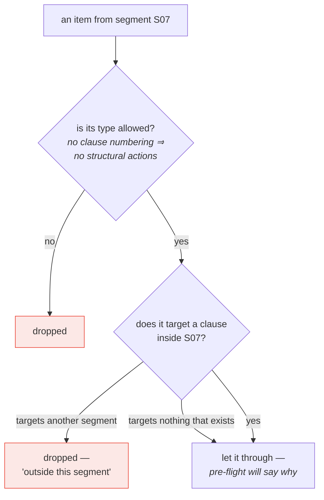
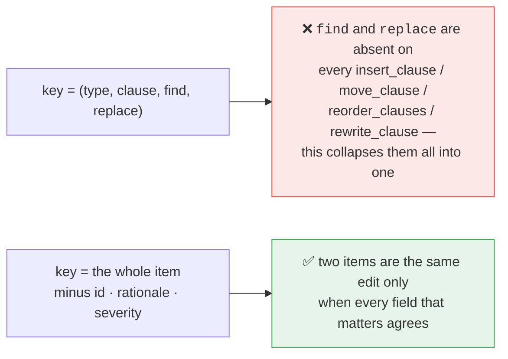
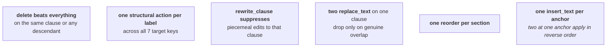
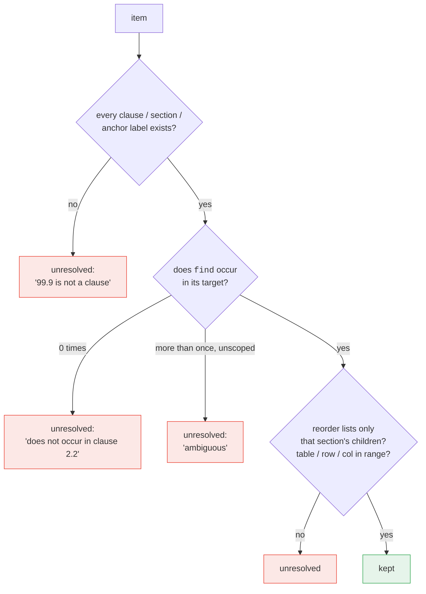
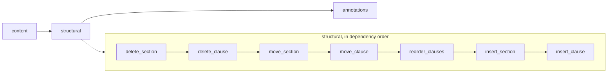
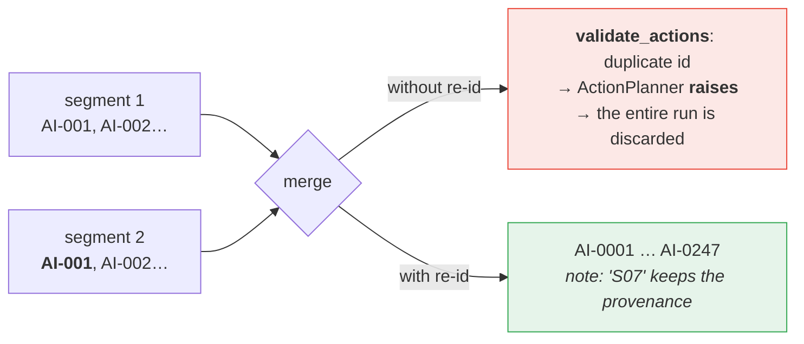

# 6 · Merge & reconciliation

*Turning proposals from segments that never saw each other into one plan.*

---

## Why this stage is adversarial towards its own input

Each segment is reviewed in isolation. Their proposals arrive with colliding
ids, overlapping edits and contradictory structural intentions — and applying
the raw union **does not fail loudly**:



So the merge assumes its input is wrong until each item proves otherwise, and
records a reason for everything it discards.

---

## The pipeline



---

## 1 · Staging — what a segment may claim



Ownership is what makes read-only boundary context safe. It deliberately does
**not** reject a clause number that exists nowhere — saying "this clause does
not exist" is more useful than "it belongs to another segment".

---

## 2 · Dedupe on the whole item



---

## 3 · Conflicts — one winner, most severe first



Items are considered in severity order, so the more serious proposal wins the
target and the loser is recorded with the rule that displaced it.

> Disjoint edits to one clause **both survive**. Only genuine intersection is a
> conflict; dropping non-overlapping edits would lose real review.

---

## 4 · Pre-flight — resolve before anything is opened



This turns *"200 failed actions halfway through applying a 500-item plan"* into
*"200 items explained before the document was touched"*.

---

## 5 · Ordering



Two reasons this exact order:

- **Deletes first** — a move into a subtree that gets deleted becomes a loud
  `ClauseError` instead of a clause silently vanishing.
- **Inserts last** — a new clause borrows its neighbour's number until
  renumbering runs, so nothing else should be resolving while a duplicate exists.

---

## 6 · Re-id — the failure that stops the run dead



Every reviewer restarts its numbering at `AI-0001`, so this is certain, not
theoretical. It is also the only conflict the rest of the system catches on its
own — and it catches it by refusing to run at all.

---

## The report

```json
{
  "summary": {
    "segments": 12, "reviewed": 9, "skipped": 3,
    "proposed": 214, "kept": 176,
    "dropped": 21, "conflicts": 9, "unresolved": 8
  },
  "segments":   [ { "id": "S07", "status": "ok", "items": 23, … } ],
  "triage":     { "notes": "…", "priorities": { "S07": "deep" } },
  "provenance": { "AI-0042": { "segment": "S07", "original_id": "AI-003" } },
  "dropped":    [ { "reason": "identical to S06/AI-011", … } ],
  "conflicts":  [ { "kept": "S07/AI-003", "rule": "delete beats…", … } ],
  "unresolved": [ { "reason": "find='…' does not occur in clause 4.2", … } ]
}
```

Every proposal is accounted for: `kept + dropped + conflicts + unresolved`
equals `proposed`. Write it with `--merge-report merge.json`.

---

## Where to look

| | |
|---|---|
| `merge.py` | `reduce_segments` and each stage above |
| `actions.py` | `validate_actions`, `STRUCTURAL_ACTIONS`, `ANNOTATION_ACTIONS` |

**Next:** [Verification →](07-verification.md)
