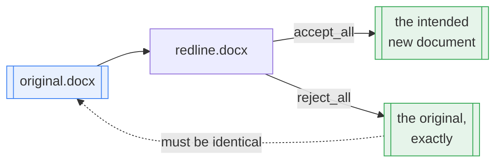
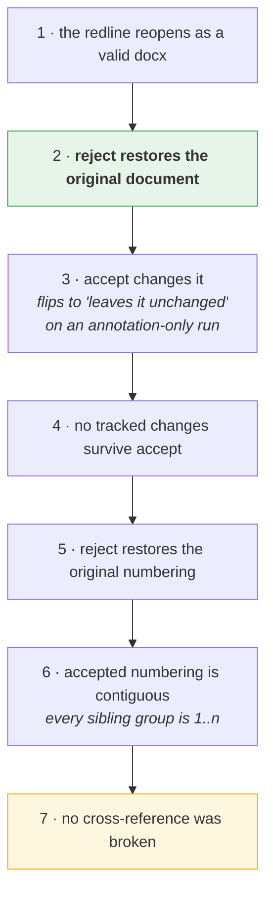
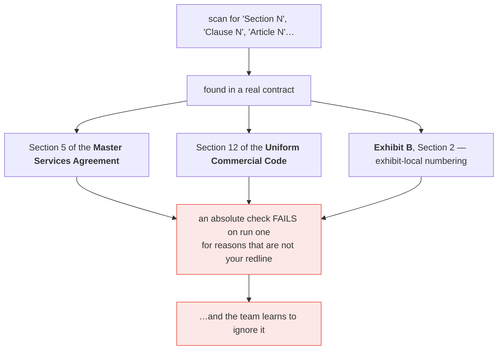
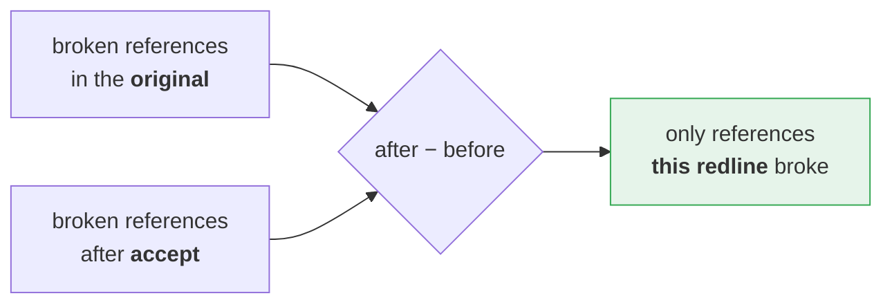
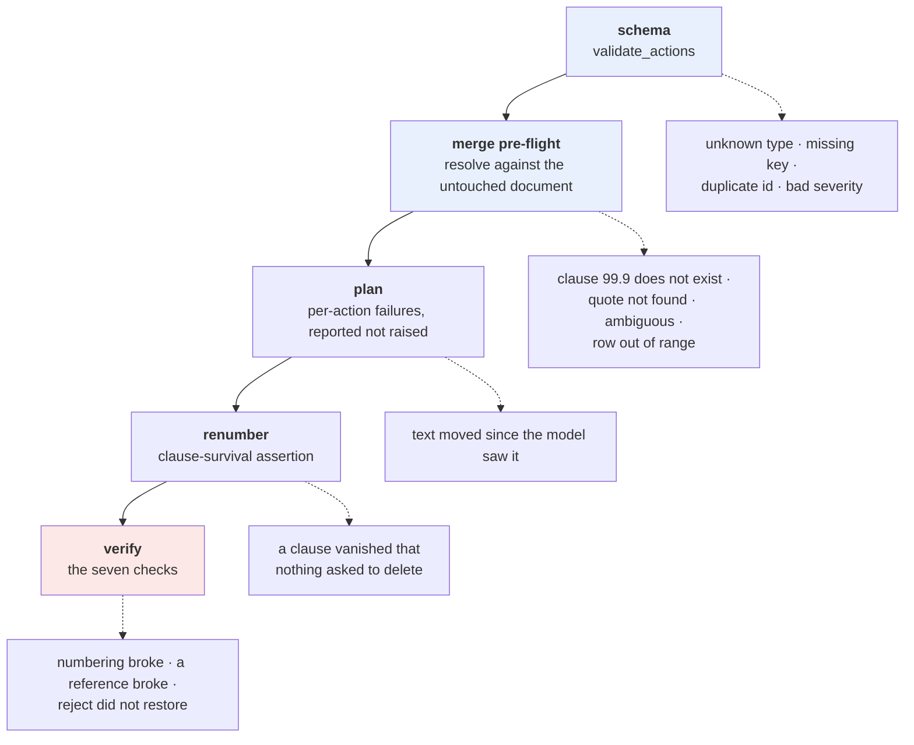
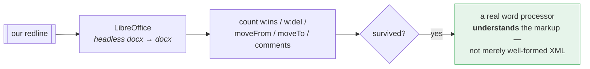
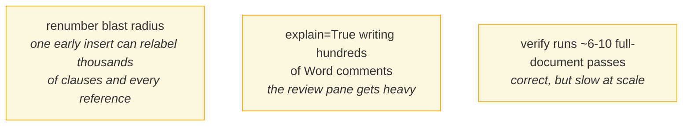

# 7 · Verification

*How the result is proven correct, without opening Word.*

---

## The central invariant



`accept_all` / `reject_all` are not conveniences — they are how the test suite
proves the markup is *semantically* right without a copy of Word. Verified to
survive nested `w:ins`/`w:del` and stacked moves.

---

## The seven checks



Checks 6 and 7 only run when renumbering is on — with `--no-renumber`,
inconsistent numbering is the expected outcome, not a failure.

---

## Check 7 measures a delta, not an absolute

This is the one worth understanding. A real contract is full of references that
look dangling and that your redline had nothing to do with:



So the check baselines against the original and asserts only what changed:



---

## Where each failure is caught

Earlier is cheaper, and the message is more useful.



---

## Independent confirmation



`scripts/demo_redline.py --libreoffice` runs this. LibreOffice drops
`w:rPrChange` on export — its own limitation, not ours — so character-formatting
revisions are excluded from that comparison. Word handles them.

---

## The test suite

**307 tests.** Almost all assert both directions of the round trip.

| File | Covers |
|---|---|
| `test_redline.py` | tracked-change primitives, run splitting, accept/reject |
| `test_addressing.py` | clause resolution, insert/delete/reorder correctness |
| `test_segments.py` | structure detection, whole-document rendering, ambiguity |
| `test_pipeline.py` | the renumbering cascade, action plans |
| `test_full_redline.py` | compare + actions + comments composed |
| `test_reviewers.py` | both providers via `httpx.MockTransport` |
| `test_chunked.py` | segmentation, triage floors, caching, concurrency |
| `test_merge.py` | every conflict and pre-flight rule |

Both providers are driven through their **real SDKs** with a mock transport — no
key, no network, but genuine request serialisation and response parsing.

```bash
uv run pytest -q                                    # 307 tests
uv run python scripts/demo_redline.py --libreoffice # self-check + LibreOffice
```

---

## What is still worth watching on a real 300-page run



**Next:** [Document compare →](08-document-compare.md)
