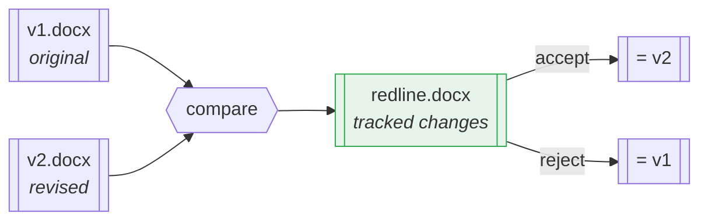
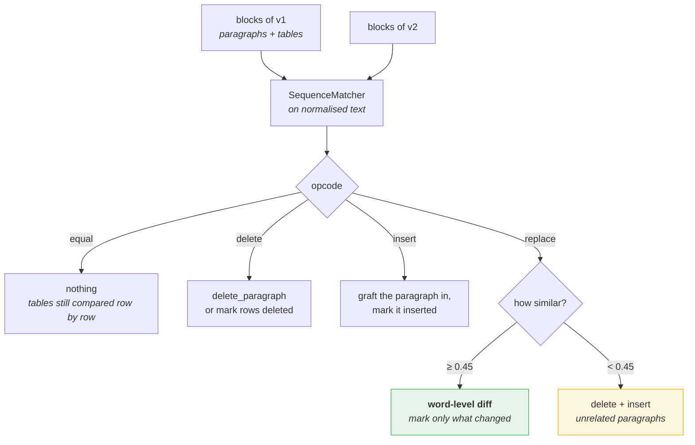
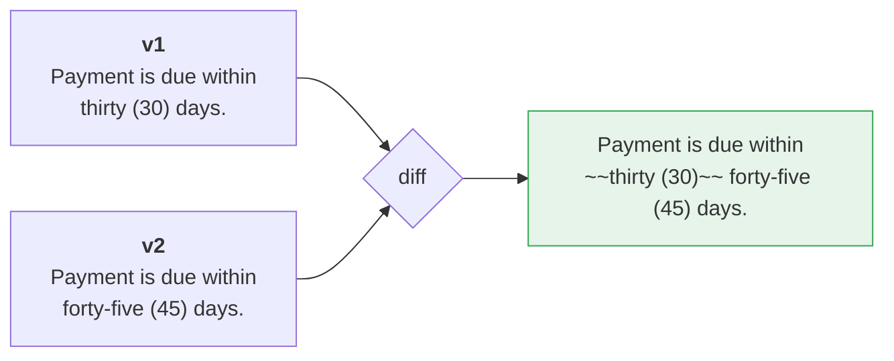
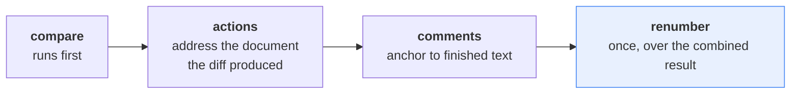
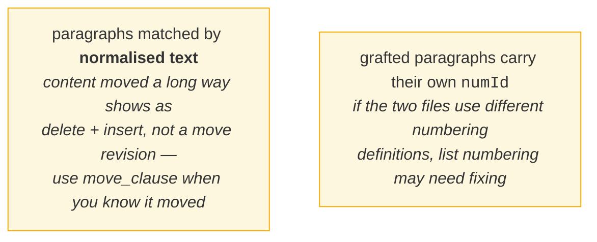

# 8 · Document compare

*Diffing two `.docx` files into one redline — Word's Compare, in Python.*

---

## What it does



The redline is built **on top of v1**, so its styles, numbering, headers and
section setup are preserved. Paragraphs that only exist in v2 are grafted in
with their own formatting.

---

## How the diff is taken



The similarity floor is what stops two unrelated paragraphs being diffed
word-by-word into unreadable confetti. Tune it with `similarity_floor`.

---

## Word-level, not whole-paragraph



Rewriting the whole paragraph as one delete + one insert is valid but
unreadable. `oxml/diffing.py` tokenises on word boundaries, and coalesces edits
separated by only a space or two so a single change reads as one revision.

---

## Composing with an action plan

A compare and a scripted plan can run on the same document. Order matters:



The planner is constructed **before** the compare, so its baseline numbering is
the original — and `finalize()` is deferred to the very end.

---

## Running it

```bash
# compare alone
python -m docx_redline compare v1.docx v2.docx -o redline.docx --author "Compare Bot"

# compare plus a plan plus comments
python -m docx_redline full v1.docx -o out.docx \
    --revised v2.docx --actions plan.json \
    --comment "10.2=Confirm the cap with finance."
```

```python
from docx_redline import redline_files, full_redline

stats = redline_files("v1.docx", "v2.docx", "redline.docx")
print(stats.format())
# paragraphs: 3 changed, 1 inserted, 0 deleted; rows: 0 inserted, 0 deleted; cells: 0 changed

full_redline("v1.docx", "out.docx", revised="v2.docx", actions="plan.json")
```

---

## Known limits



---

## Where to look

| | |
|---|---|
| `editing/compare.py` | `compare_documents`, `compare_into`, `redline_files` |
| `oxml/diffing.py` | `diff_ops` — the word-level diff |
| `planning/pipeline.py` | how a compare composes with an action plan |

**Next:** [Failure modes →](09-failure-modes.md)
