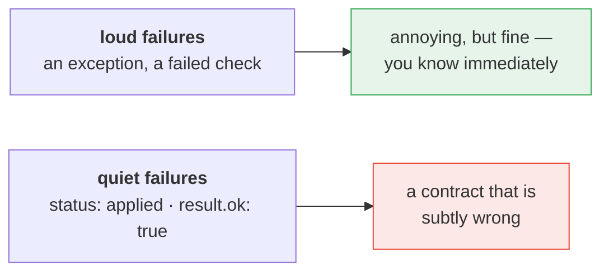
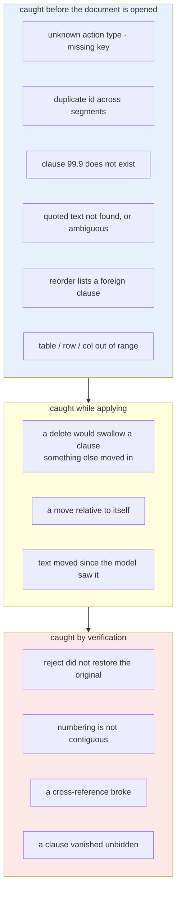
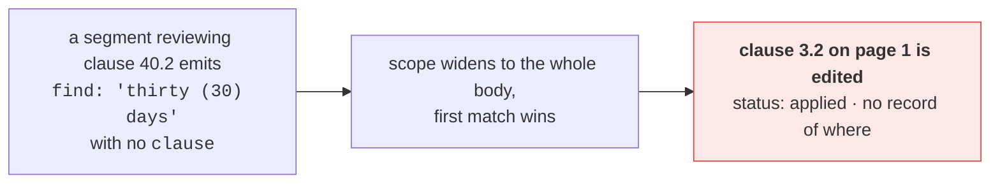
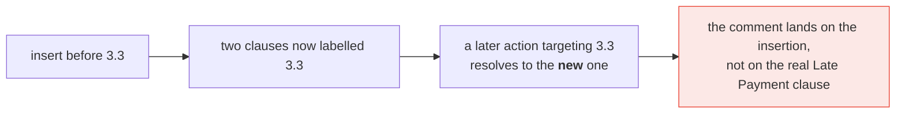
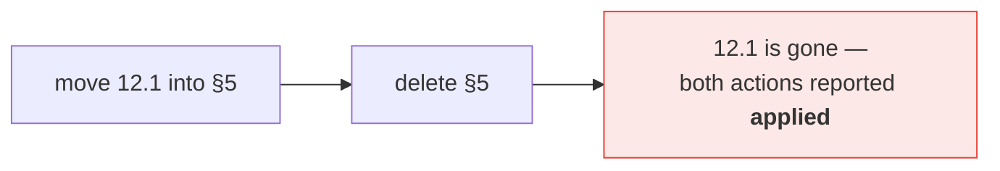
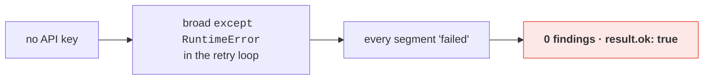
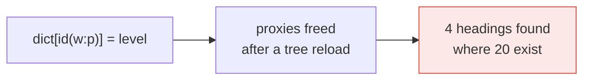
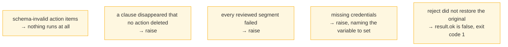
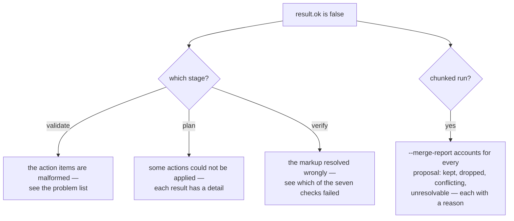

# 9 · Failure modes

*What goes wrong, and where it gets caught.*

Most of these were real bugs in this codebase. Every one of them reported
`applied` while doing the wrong thing — which is why they are worth writing down.

---

## The shape of the danger

Nearly all the work in `merge.py` and the guards in `actions.py` exist to move
things from the bottom row to the top.

---

## Where each class is caught

---

## The ones that used to be silent

### Ambiguous quotes edited the wrong paragraph

**Now:** an unscoped quote matching more than one paragraph is refused, naming
the matches. `all: true` opts back in deliberately.

### A new clause stole its neighbour's number

`insert_clause before_clause="3.3"` mints a *second* clause labelled `3.3`, and
lookup was first-match-wins:

**Now:** lookup prefers the clause that was already there, duplicates are
reported, and inserts are ordered **last** so nothing resolves while one exists.

### A delete swallowed a clause that was moved into it

**Now:** a delete refuses when its subtree contains anything moved or inserted
earlier in the run, and says which clauses. The merge stage also drops any
action targeting a delete closure.

### A credentials failure looked like a clean review

**Now:** `RedlineCredentialsError` propagates, and a run where every segment
failed raises rather than returning an empty plan.

### An `id()`-keyed map lost entries

Twice. lxml hands out element proxies on demand and frees them when the last
reference goes — so a `dict` keyed on `id(element)` silently loses entries, and
can start matching an unrelated element once CPython recycles the address.

**Now:** either hold the elements alive in the map (`LabelSnapshot`) or use a
resolver function instead of a map (`level_resolver`).

---

## Failures that are *meant* to be loud

---

## Two gotchas that are not bugs

**`Paragraph.text` misses tracked insertions.** python-docx reads only `w:r`
children, so it cannot see anything inside a `w:ins` — every insertion this
library makes — while still returning text that has been struck out. Use
`rl.text_of(paragraph)`.

**LibreOffice drops `w:rPrChange` on export.** Its own limitation. Insert,
delete and move revisions survive it fine; Word handles formatting revisions
correctly.

---

## Reading a run that went wrong

---

## Where to look

| | |
|---|---|
| `merge.py` | pre-flight, conflict rules, the report |
| `actions.py` | `_require_unique`, the delete guard, `_assert_no_clause_vanished` |
| `pipeline.py` | `verify` and the seven checks |
| `tests/test_merge.py` | one test per failure above |

**Back to:** [index](README.md)
