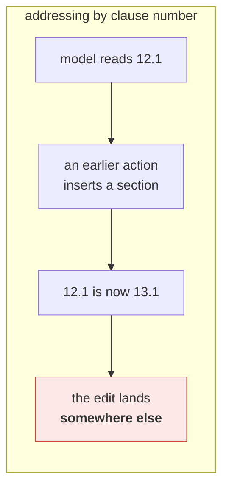
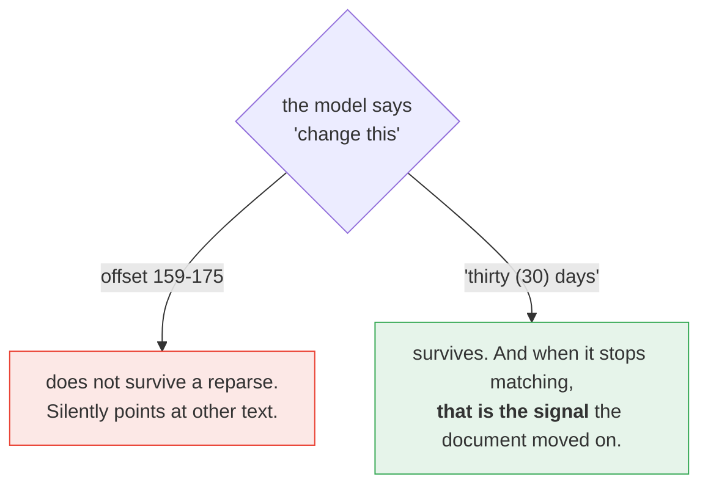
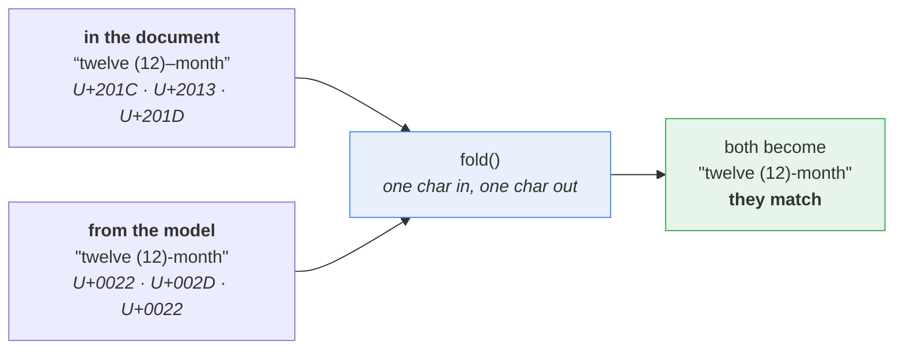
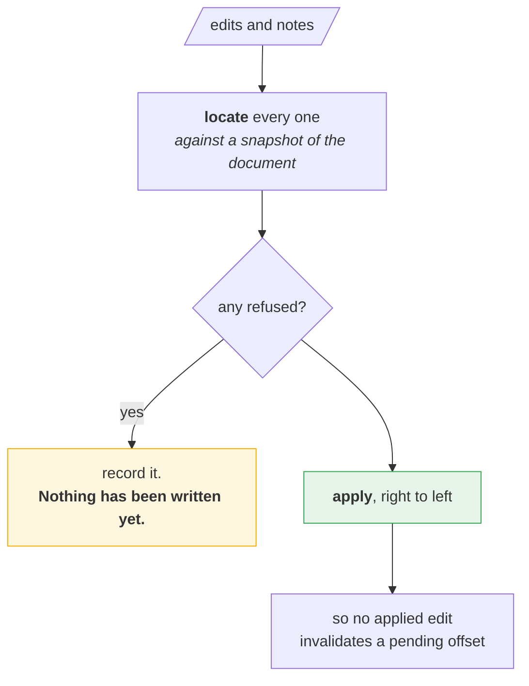
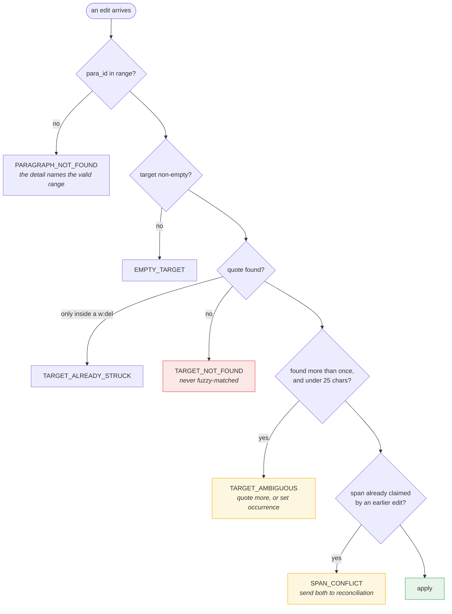
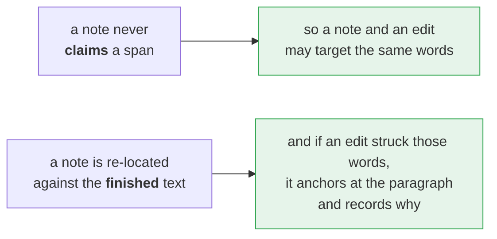
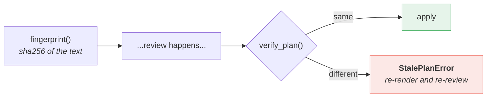

# 10 · Paragraph addressing

*How a model points at text, and how a wrong pointer is refused rather than guessed.*

---

## The problem this solves

[Clause renumbering](03-clause-renumbering.md) shows why clause numbers are the
right address for a lawyer. They are the wrong one for a machine: they move, the
renumbering pass rewrites them, and a document with no numbering has nothing to
address at all.



`ParagraphIndex` gives every `w:p` in scope a **stable integer id** in document
order, and pairs it with an **exact quoted span**. Two coordinates, both of
which the model can see in what it was given.

---

## Why a quote, and not an offset



A stale offset fails silently. A stale quote fails loudly, which is the whole
difference.

---

## fold — matching what Word actually stored

A model quotes a phrase with straight quotes and a plain hyphen. Word stored
curly quotes and an en dash. Neither is wrong; they simply are not equal.



Every mapping is **one character to one character** — smart quotes, all six
dashes, every exotic space, tabs. That is what makes an offset computed on the
folded string valid on the raw string it came from, so the result can be handed
straight to `oxml/edits.py`.

NFKC is applied one character at a time and kept only when it maps 1 → 1: `Ａ`
folds to `A`, while the `fi` ligature is left alone rather than expanding to two
characters and shifting every offset after it.

---

## Locate everything, then apply — right to left



Locating and applying must stay separate passes. Locate lazily and the second
edit to touch a paragraph sees XML the first one already rewrote — its text now
sits in `w:delText` — and the miss gets misdiagnosed as a parse problem rather
than the collision it is.

A plan that is half wrong therefore cannot leave the document half edited by the
time it is found out.

---

## Six ways to be refused



`TARGET_NOT_FOUND` is the important one. The engine will not fuzzy-match a quote
that nearly fits — a near miss is far more likely to be a model quoting from
memory than a document that shifted by a word.

---

## Notes are anchors, not rewrites

A `ReviewNote` becomes a Word comment, so it cannot invalidate anyone's offsets.
That buys two behaviours edits do not get:



Commenting *on* a strikeout is usually the point, so `TARGET_ALREADY_STRUCK`
refuses an edit but is only a fallback for a note.

---

## Binding a plan to a document version

The model may take minutes to answer. The document may not have waited.



It hashes text only, so re-attributing the author or re-stamping the date does
not invalidate a plan. This is the guard that stops a v3 redline landing on a
v4 document.

---

## What the model is given

`render()` is the cacheable prefix. Every line starts with the id an edit
addresses, so the model can only ever point at a paragraph that exists:

```
<<clause 3.2>>
[19] 3.2  Invoicing. Provider shall invoice Customer annually in advance ...
```

Ids are positions in `rl.paragraphs()`. They survive every text edit, comment
and formatting change; a structural pass that inserts or deletes a paragraph
invalidates them, which is what `refresh()` and a new `fingerprint()` are for.

---

## Where this sits

| | Addresses by | Verifies before writing |
|---|---|---|
| `Redliner` | text, paragraph object, table index | no |
| **`ParagraphIndex`** | **integer id + quoted span** | **yes — every edit is located first** |
| `ActionPlanner` | clause number (`"12.1"`) | schema first, then clause resolution |

Use this layer when a model quotes spans back at you and may be wrong. Use
[the action pipeline](04-action-pipeline.md) when a model is restructuring the
document and the numbering has to follow.

---

## Where to look

| | |
|---|---|
| `editing/paragraphs.py` | `ParagraphIndex`, `fold`, `Rejection`, `fingerprint`, `verify_plan` |
| `oxml/textmap.py` | the flat coordinate space the offsets live in |
| `tests/test_paragraphs.py` | one test per rejection, and the length invariant of `fold` |
| [`examples/13_rejections.py`](../examples/13_rejections.py) | every refusal, triggered one at a time |

**Back to:** [index](README.md)
