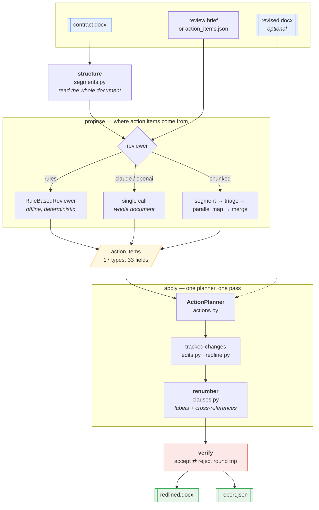
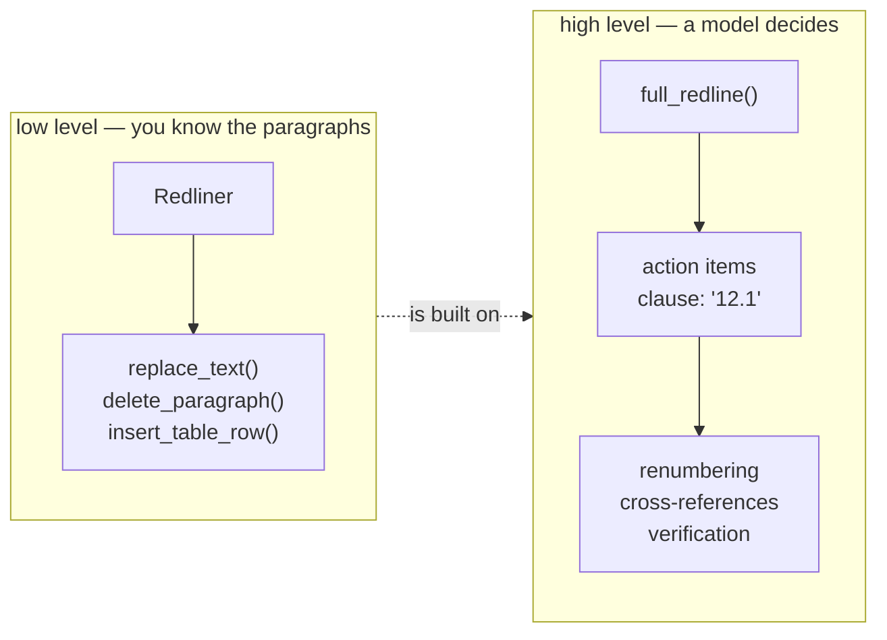

# docx-redline — how it works

Nine short documents, one per workflow. Each is a diagram plus the few facts you
need to read it. Start here, then follow whichever thread you care about.

| | Workflow | Read it when you want to know |
|---|---|---|
| 1 | [Tracked changes](01-tracked-changes.md) | How one edit becomes Word revision markup |
| 2 | [Document structure](02-document-structure.md) | How the document is read and shown to a model |
| 3 | [Clause renumbering](03-clause-renumbering.md) | Why moving 12.1 rewrites 16 numbers and 5 references |
| 4 | [The action pipeline](04-action-pipeline.md) | What `full_redline` actually does, stage by stage |
| 5 | [Chunked review](05-chunked-review.md) | How a 300-page contract is reviewed |
| 6 | [Merge & reconciliation](06-merge-reconciliation.md) | How conflicting proposals become one plan |
| 7 | [Verification](07-verification.md) | How the result is proven correct |
| 8 | [Document compare](08-document-compare.md) | Diffing two `.docx` files into one redline |
| 9 | [Failure modes](09-failure-modes.md) | What goes wrong, and where it is caught |

---

## The system in one picture



---

## Two layers, pick the one you need



|  | `Redliner` | `full_redline` |
|---|---|---|
| Addresses content by | text, paragraph, table index | clause number (`"12.1"`) |
| Knows about numbering | no | yes — renumbers and repoints references |
| Input | method calls | action items from a reviewer or a file |
| Use when | you know exactly what to edit | something else is deciding |

---

## Where the code lives

```
docx_redline/
  ns.py oxml.py textmap.py    OOXML plumbing: namespaces, elements, run splitting
  errors.py                   shared exception hierarchy
  edits.py                    the primitives: w:ins / w:del / ¶-marks / rows
  redline.py                  Redliner — the public low-level API
  review.py                   accept / reject / summarise
  diffing.py                  word-level diff
  compare.py                  document-vs-document redline
  clauses.py                  clause tree, renumbering, cross-references
  segments.py                 whole-document view: detection, rendering, segmentation
  actions.py                  action vocabulary + the planner
  agent.py                    reviewers: Claude, OpenAI, offline rules
  chunked.py                  long documents: index, triage, parallel map, cache
  merge.py                    reconciling proposals from independent segments
  pipeline.py                 the staged pipeline and full_redline
  ops.py cli.py               declarative ops, command line
```

**307 tests.** The invariant nearly all of them lean on:

> `accept(redline)` is the intended new document.
> `reject(redline)` is the original, exactly.
