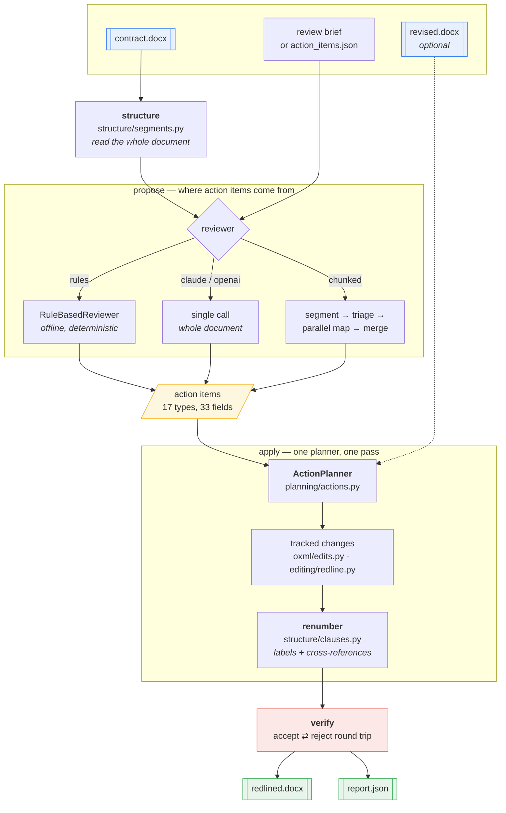
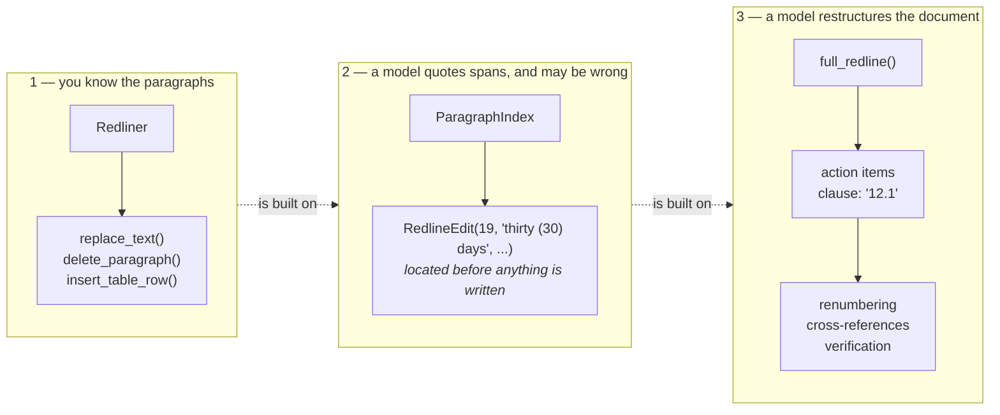

# docx-redline — how it works

Ten short documents, one per workflow. Each is a diagram plus the few facts you
need to read it. Start here, then follow whichever thread you care about.

Want to see the output rather than read about it? The README has a
[gallery of rendered redlines](../README.md#what-it-produces), and
[`examples/`](../examples/) has 26 runnable files covering every option.

| | Workflow | Read it when you want to know |
|---|---|---|
| 1 | [Tracked changes](01-tracked-changes.md) | How one edit becomes Word revision markup |
| 2 | [Document structure](02-document-structure.md) | How the document is read and shown to a model |
| 3 | [Clause renumbering](03-clause-renumbering.md) | Why moving 12.1 rewrites 16 numbers and 5 references |
| 4 | [The action pipeline](04-action-pipeline.md) | What `full_redline` actually does, stage by stage |
| 5 | [Chunked review](05-chunked-review.md) | How a 300-page contract is reviewed |
| 6 | [Merge & reconciliation](06-merge-reconciliation.md) | How conflicting proposals become one plan |
| 7 | [Verification](07-verification.md) | How the result is proven correct |
| 8 | [Document compare](08-document-compare.md) | Diffing two `.docx` files into one redline |
| 9 | [Failure modes](09-failure-modes.md) | What goes wrong, and where it is caught |
| 10 | [Paragraph addressing](10-paragraph-addressing.md) | How a model points at text, and how a wrong pointer is refused |

---

## The system in one picture



---

## Three layers, pick the one you need



|  | `Redliner` | `ParagraphIndex` | `full_redline` |
|---|---|---|---|
| Addresses content by | text, paragraph, table index | integer id + quoted span | clause number (`"12.1"`) |
| Knows about numbering | no | reads it, does not rewrite it | yes — renumbers and repoints references |
| Verifies before writing | no | **yes** | schema, then clause resolution |
| Input | method calls | `RedlineEdit` / `ReviewNote`, or model JSON | action items from a reviewer or a file |
| Use when | you know exactly what to edit | something else is deciding, and may be wrong | something else is restructuring |
| Read | [1](01-tracked-changes.md) | [10](10-paragraph-addressing.md) | [4](04-action-pipeline.md) |

---

## Where the code lives

Four subpackages, strictly layered — each may import downward and never up, and
a test asserts it.

```
oxml  ->  structure  ->  editing  ->  planning  ->  cli
```

```
docx_redline/
  errors.py                   shared exception hierarchy
  cli.py                      command line front end

  oxml/                       OOXML plumbing — knows nothing about clauses
    ns.py elements.py           namespaces, element construction, schema order
    revisions.py                author, timestamp, unique w:id allocation
    textmap.py                  flat character map over a paragraph; run splitting
    edits.py                    the primitives: w:ins / w:del / ¶-marks / rows
    diffing.py                  word-level diff

  structure/                  reading the document — never writes a revision
    clauses.py                  clause tree, renumbering, cross-references
    segments.py                 whole-document view: detection, rendering, segmentation

  editing/                    applying edits — everything here writes revisions
    redline.py                  Redliner — the public low-level API
    review.py                   accept / reject / summarise
    compare.py                  document-vs-document redline
    ops.py                      declarative JSON edit plans
    paragraphs.py               paragraph ids, folded matching, plan fingerprints

  planning/                   deciding edits — what to change, not how
    actions.py                  action vocabulary + the planner
    merge.py                    reconciling proposals from independent segments
    agent.py                    reviewers: Claude, OpenAI, offline rules
    chunked.py                  long documents: index, triage, parallel map, cache
    pipeline.py                 the staged pipeline and full_redline
```

**350 tests** in `tests/`, **26 runnable examples** in `examples/`. The invariant
nearly all of them lean on:

> `accept(redline)` is the intended new document.
> `reject(redline)` is the original, exactly.
